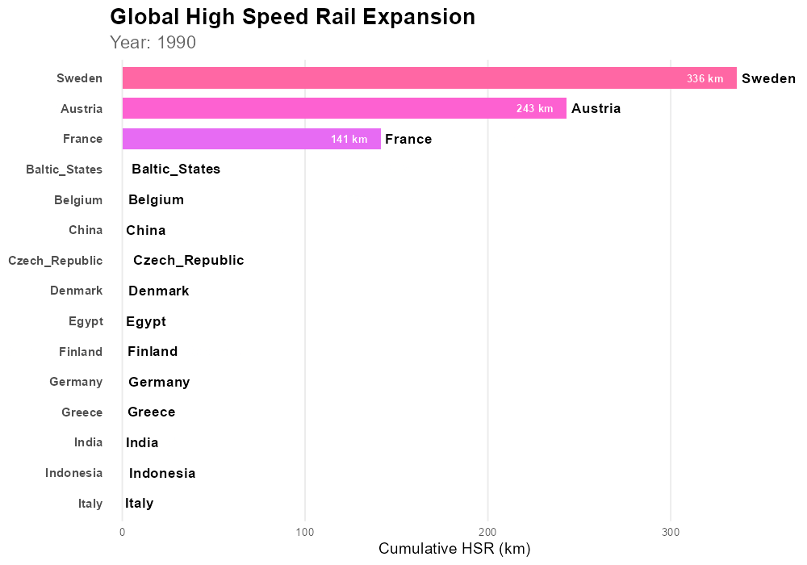

```{r setup}
#| include: false
library(tidyverse)
library(skimr)
library(hrbrthemes)
library(rmarkdown)
library(dplyr)
library(ggplot2)
library(sf)
library(rnaturalearth)
library(rnaturalearthdata)
library(ggthemes)
library(maps)
library(rsconnect)

# Add other packages as needed.
# Examples:
# library(lubridate)
# library(janitor)
# library(scales)
# library(viridis)
# library(plotly)
# library(DT)
# library(sf)

# Feel free to revise this theme.
theme_set(
  theme_ipsum() +
    theme(
      strip.background = element_rect(fill = "lightgray"),
      axis.title.x = element_text(size = rel(1.33)),
      axis.title.y = element_text(size = rel(1.33))
    )
)

# Optional color-blind-friendly scales.
# scale_colour_discrete <- function(...) scale_colour_viridis_d(...)
# scale_fill_discrete <- function(...) scale_fill_viridis_d(...)
```

# Project Overview

- **Project Webpage:** [HSR Visualization project](https://1aaronz.github.io/danl-310-data-storytelling.html)

This project visualizes global high-speed rail (HSR) progress compared to the US. It highlights the difference in the length of high-speed rail other countries have managed to achieve compared to the relative slow HSR progress of the US. 60% of U.S. voters have a favorable opinion of high-speed rail and only 16% view it unfavorably (Public Policy Polling). Despite public interest in HSR in the US, the US has fallen behind in HSR construction.

The analysis examines historical HSR growth and visualizes changes over time, extending up to the present day and 10 year projected estimates. 

# Background and Context

What qualifies as "high speed rail" can be ambiguous. For the purposes of this project, high-speed rail is defined as "the length of track where passenger trains can reliably go at least 200 kilometers per hour". In the case of the United States, the North East Corridor can, in theory, carry high speed rail much further than what the dataset for this project provides. However, only about 80km of the North East Corridor is currently operating high speed rail, so only 80km is counted for this project. This benchmark is applied to all countries in the dataset.

The 10 year-projected HSR construction is based on projects that have been officially announced, with an estimated completion date within the next 10 years.

# Data

```{r data-import}
hsr <- read.csv("hsr.csv") %>% 
  select(Line, Length_km, Opening_year, country, Status, Maximum.speed)

paged_table(hsr)
```

## Key Variables

Line: Name of high speed rail line

Length_KM: Length of the high speed rail line in Kilometers

country: Name of the country the rail line belongs to

Opening_year: The year the high speed rail on the line became operational

## Unit of Observation

Each row represents one rail line capable of carrying high-speed rail.

## Data Source

The data was scraped from tables from Wikipedia on 4/30/2026.

The scraping and initial cleaning process is shown in Appendix A.

# Data Preparation and Transformation

```{r data-preparation}

hsr_all <- read.csv("hsr_all.csv")

#CLEAN LENGTH COLUMN---------------------------------------------------------
if ("Length" %in% names(hsr_all)) {
  hsr_all <- hsr_all %>%
    mutate(
      Length_clean = gsub(",", "", Length),
      Length_km = as.numeric(str_extract(Length_clean, "[0-9.]+"))
    )
}

# CLEAN OPENING YEAR------------------------------------------------------
if ("Opening" %in% names(hsr_all)) {
  hsr_all <- hsr_all %>%
    mutate(
      Opening_year = as.numeric(str_extract(Opening, "\\d{4}"))
    )
}

hsr <- hsr_all %>% 
  select(Line, Length_km, Opening_year, country, Status, Maximum.speed)
```

The the length and opening year columns had to have the characters removed from them and set as numeric columns.

```{r}
hsr_2026 <- hsr %>% 
  filter(Opening_year<=2026) %>% 
  group_by(country) %>% 
  summarise(total_km = sum(Length_km))


hsr_2000 <- hsr %>% 
  filter(Opening_year<=2000) %>% 
  group_by(country) %>% 
  summarise(total_km = sum(Length_km))

hsr_2000 <- hsr_2000 %>%
  mutate(
    country = as.character(country),
    is_us = country == "United_States")
```

Additional cleaning for creating dataframes of certain years and creating a flag for the US to highlight on the maps.

# Descriptive Statistics

## Basic Summary

```{r summary-statistics}
skim(hsr)
```

## Total HSR by country summary

```{r descriptive-summary}

hsr |>
  group_by(country) |>
  filter(Opening_year<=2026) %>% 
  summarize(
    n = n(),
    mean_HSR_line = mean(Length_km, na.rm = TRUE),
    Total_HSR_km = sum(Length_km, na.rm = TRUE)
  ) |>
  arrange(desc(Total_HSR_km))
```

## Initial Observations

China appears as a big outlier in total HSR kilometers (33504). The US is only seen much further down the list, and almost all countries that have any HSR are ahead of the US. 

# Data Visualization and Storytelling

## Visualization 1: HSR by country in 2000

```{r visualization-1}
# Replace this example with your own visualization.

hsr_2000 <- hsr_2000 %>%
  mutate(
    country = fct_reorder(country, total_km)
  )

ggplot(hsr_2000, aes(
  x = total_km,
  y = fct_reorder(country, total_km)
)) +
  geom_col(aes(fill = country)) +
  scale_y_discrete(labels = function(x) {
    ifelse(x == "United_States", "United_States", x)
  }) +
  theme_minimal() +
  theme(
    legend.position = "none",
    axis.text.y = element_text(
      color = ifelse(levels(fct_reorder(hsr_2000$country, hsr_2000$total_km)) == "United_States",
                     "red", "black"),
      face = ifelse(levels(fct_reorder(hsr_2000$country, hsr_2000$total_km)) == "United_States",
                    "bold", "plain")
    )
  ) +
  labs(
    title = "Total Operational High Speed Rail Per Country in 2000",
    y = "",
    x= "Total HSR in Km",
    subtitle = "Countries Ahead of the US: 13"
  )+
  scale_fill_viridis_d()
```

**Interpretation:**\
This gives us an initial view of what the landscape for HSR initially looked like in 2000. High speed rail was exclusive to European countries, Japan, and the US, with Japan leading the pack at nearly 2500km. Germany was a close second, followed by France. 

While the US was among only 16 countries with HSR in 2000, the US had only a small amount, less than 100km. The country with the most HSR in 2000, Japan, had 31 times more HSR than the US.

## Visualization 2: HSR by Country in 2026

```{r visualization-2}
hsr_2026 <- hsr_2026 %>%
  left_join(
    hsr_2000 %>% select(country, total_km) %>% rename(km_2000 = total_km),
    by = "country"
  ) %>%
  mutate(
    km_2000 = ifelse(is.na(km_2000), 0, km_2000),
    new_hsr = km_2000 == 0
  )

hsr_2026 <- hsr_2026 %>%
  mutate(
    country = fct_reorder(country, total_km)
  )

ggplot(hsr_2026, aes(
  x = total_km,
  y = fct_reorder(country, total_km)
)) +
  geom_col(aes(fill = country)) +
  scale_y_discrete(labels = function(x) {
    x
  }) +
  theme_minimal() +
  theme(
    legend.position = "none",
    axis.text.y = element_text(
      color = ifelse(
        levels(fct_reorder(hsr_2026$country, hsr_2026$total_km)) == "United_States",
        "red",
        "black"
      ),
      face = ifelse(
        levels(fct_reorder(hsr_2026$country, hsr_2026$total_km)) %in% 
          hsr_2026$country[hsr_2026$new_hsr],
        "bold",
        "plain"
      )
    )
  ) +
  labs(
    title = "Total Operational High Speed Rail Per Country in 2026",
    y = "",
    x = "Total HSR in Km",
    subtitle = "Countries with no HSR in 2000 are Bolded | Countries Ahead of the US: 26"
  ) +
  scale_fill_viridis_d()
```

**Interpretation:**\
Between 2000 and 2026, 13 more countries jumped ahead of the US in HSR km. Most notably is China, which went from having no HSR in 2000, to nearly 35000 km in 2026, beating out all other countries by a long-shot. The US only gained 50km of HSR between 2000 and 2026, with the opening of the Bright-line in Florida. Out of all the countries that have HSR, Denmark is the only country the US is ahead of.

The discrepancy between the front runner and the US grew a significant amount between 2000 and 2026. While the front runner had 31 times more HSR than the US in 2000, in 2026 china, the current front runner, has 245 times more HSR than the US.  

## Visualization 3: Future Prospects, the 10 year projection of new HSR by country

```{r visualization-3}
hsr_2036 <- hsr %>% 
  filter(Opening_year<=2037) %>% 
  filter(Opening_year>=2027) %>% 
  group_by(country) %>% 
  summarise(total_km = sum(Length_km))

hsr_2036 <- hsr_2036 %>%
  filter(!is.na(total_km))

# 2036 plot --------------------------------------------------------------
hsr_2036 <- hsr_2036 %>%
  mutate(
    country = fct_reorder(country, total_km)
  )

ggplot(hsr_2036, aes(
  x = total_km,
  y = fct_reorder(country, total_km)
)) +
  geom_col(aes(fill = country)) +
  scale_y_discrete(labels = function(x) {
    x
  }) +
  theme_minimal() +
  theme(
    legend.position = "none",
    axis.text.y = element_text(
      color = ifelse(
        levels(fct_reorder(hsr_2036$country, hsr_2036$total_km)) == "United_States",
        "red",
        "black"
      ),
      face = ifelse(
        levels(fct_reorder(hsr_2036$country, hsr_2036$total_km)) %in% 
          hsr_2036$country[hsr_2036$total_km],
        "bold",
        "plain"
      )
    )
  ) +
  labs(
    title = "10 Year Projection of New HSR by Country",
    y = "",
    x = "Total HSR in Km",
    subtitle = "HSR planned between 2027-2037"
  ) +
  scale_x_continuous(
    breaks = c(0, 2500, 5000, 10000, 20000, 25000),
    limits = c(0, 30000),
  expand=c(0,0))+
  scale_fill_viridis_d()

```

**Interpretation:**\
The United States is set to make some progress within the next 10 years. The opening of California HSR and the Bright line west, both expected within the next 10 years, are set to add 626 more km of HSR to the US. Even with this boost, 11 countries are still set to outpace the US in new construction. China plans to nearly double their already extensive HSR network in the next 10 years.

## Visualization 4: World map of HSR compared to the US

```{r visualization-4}
hsr_clean <- hsr_2026 %>%
  mutate(
    country = dplyr::recode(country,
                     "United_States" = "United States of America",
                     "United_Kingdom" = "United Kingdom",
                     "South_Korea" = "South Korea",
                     "Saudi_Arabia" = "Saudi Arabia",
                     "Russia" = "Russia"
    )
  )

world <- ne_countries(scale = "medium", returnclass = "sf")

us_value <- hsr_clean %>%
  filter(country == "United States of America") %>%
  pull(total_km)

world_hsr <- world %>%
  left_join(hsr_clean, by = c("name" = "country")) %>%
  mutate(
    status = case_when(
      name == "United States of America" ~ "United States",
      total_km > us_value ~ "Above US",
      TRUE ~ "Below US" 
    )
  )

ggplot(world_hsr) +
  geom_sf(aes(fill = status), color = "white", linewidth = 0.2) +
  scale_fill_manual(
    values = c(
      "Above US" = "#D55E00",
      "Below US" = "#999999",
      "United States" = "#0072B2"
    )
  ) +
  labs(
    title = "Countries With More Operational High Speed Rail than the US (2026)",
    fill = ""
  )+
  theme_map()+
  theme(title = element_text(size=15),
        axis.text = element_blank(),
        legend.position = c(0, 0.5), 
        legend.justification = c(0, 0.5),
        legend.text = element_text(size = 12),
        plot.title = element_text(hjust = 0.5))
```

**Interpretation:**\
This graph helps visualize how far behind the US currently is to the rest of the world. The countries with more high speed rail take up a large area on the map.

## Shiny App
*Only one instance of the app can be actively ran at a time
```{=html}
<div style="display: flex; justify-content: center; margin: 1em 0;">
  <iframe
    src="https://yjmcom-aaron-zalen.shinyapps.io/hsr-app/"
    width="800"
    height="800"
    frameborder="0"
    style="border: none;"
  ></iframe>
</div>
```

## Animated Plot



## Dashboard

- **The dashboard for my project can be found here:** [1aaronz.github.io/danl310dashboard.html](https://1aaronz.github.io/danl310dashboard.html)

The shiny app allows interactive visualization with the cumulative HSR bar chart.
The dashboard organizes the all the charts together.

# Discussion

HSR was almost exclusively a European phenomenon in 2000. Since then, HSR has been adopted by many countries throughout the world, with even more countries building their first lines as time goes on. While the data suggests global adoption is only set to increase, the US has appears to have stalled behind the rest of the world in building HSR, and continues to build HSR at a slower rate than other countries. 

## Limitations

The 10 year projection is subject to change. It is based off of projects that have been officially announced. New projects set to be complete within the next 10 years could be announced, and projects that were announced could be cancelled.

# Conclusion

The data shows that the US has fallen behind in high-speed rail construction considerably. Since 2000, 13 countries that previously had no high speed rail have built enough rail today to be ahead of the US in HSR km. With the exception of Denmark, all of the 13 countries that had more HSR than the US in 2000 still have more HSR in 2026, with many increasing the gap between them and the US. 

If the US is to catchup to the rest of the world, drastic changes will need to be made to the entire pipeline of funding, building, and operating high-speed rail lines

# Future Directions

Further research into this topic could involve looking into other variables for measuring high speed rail contributions such as amount of funding allocated to HSR projects. 

Additional research could look into areas where high speed-rail could be justified by analyzing the variables of places that have already built high-speed rail, such as population served, cost per mile, and terrain. We could then look for places that have similar or better statistics as good candidates for future high-speed rail prospects.

# References

Public Policy Polling. (2024). National survey on high-speed rail. https://www.ushsr.com/

Wikipedia contributors. (n.d.). List of high-speed railway lines. In Wikipedia. Retrieved May 6, 2026, from https://en.wikipedia.org/wiki/List_of_high-speed_railway_lines

# Appendix

Use the appendix for extra materials that are useful but not central to the story.

Examples:

- additional tables,
- additional figures,
- extra data cleaning details,
- code that is too long for the main narrative.

#### Appendix A: Initial code to scrape the data

```{r appendix-code}
#| eval: FALSE

library(rvest)
library(dplyr)
library(purrr)
library(stringr)
library(xml2)

#SCRAPE PAGE---------------------------------------------------------

url <- "https://en.wikipedia.org/wiki/High-speed_rail_by_country"
page <- read_html(url)

nodes <- xml_find_all(page, "//h2 | //h3 | //table")

tables <- list()
current_name <- NULL
i <- 1

for (node in nodes) {
  
  # update section name
  if (xml_name(node) %in% c("h2", "h3")) {
    current_name <- xml_text(node, trim = TRUE)
  }
  
  # store table under current section name
  if (xml_name(node) == "table") {
    df <- html_table(node, fill = TRUE)
    
    df <- as.data.frame(df, stringsAsFactors = FALSE)
    df[] <- lapply(df, as.character)
    
    tables[[i]] <- df
    names(tables)[i] <- current_name
    i <- i + 1
  }
}

#MANUAL COUNTRY ASSIGNMENT---------------------------------------------------
egypt <- tables[[5]]
morocco <- tables[[6]]
china <- tables[[7]]
india <- tables[[8]]
indonesia <- tables[[9]]
japan <- tables[[10]]
saudi_arabia <- tables[[11]]
south_korea <- tables[[12]]
taiwan <- tables[[13]]
thailand <- tables[[14]]
turkey <- tables[[15]]
uzbekistan <- tables[[16]]
austria <- tables[[17]]
baltic_states <- tables[[18]]
belgium <- tables[[19]]
czech_republic <- tables[[20]]
denmark <- tables[[21]]
finland <- tables[[22]]
france <- tables[[23]]
germany <- tables[[24]]
greece <- tables[[25]]
italy <- tables[[26]]
netherlands <- tables[[27]]
norway <- tables[[28]]
poland <- tables[[29]]
portugal <- tables[[30]]
russia <- tables[[31]]
serbia <- tables[[32]]
spain <- tables[[33]]
sweden <- tables[[34]]
switzerland <- tables[[35]]
united_kingdom <- tables[[36]]
united_states <- tables[[37]]

hsr_list <- list(
  Egypt = egypt,
  Morocco = morocco,
  China = china,
  India = india,
  Indonesia = indonesia,
  Japan = japan,
  Saudi_Arabia = saudi_arabia,
  South_Korea = south_korea,
  Taiwan = taiwan,
  Thailand = thailand,
  Turkey = turkey,
  Uzbekistan = uzbekistan,
  Austria = austria,
  Baltic_States = baltic_states,
  Belgium = belgium,
  Czech_Republic = czech_republic,
  Denmark = denmark,
  Finland = finland,
  France = france,
  Germany = germany,
  Greece = greece,
  Italy = italy,
  Netherlands = netherlands,
  Norway = norway,
  Poland = poland,
  Portugal = portugal,
  Russia = russia,
  Serbia = serbia,
  Spain = spain,
  Sweden = sweden,
  Switzerland = switzerland,
  United_Kingdom = united_kingdom,
  United_States = united_states
)

#COMBINE ALL TABLES---------------------------------------------------------
hsr_all <- bind_rows(
  lapply(names(hsr_list), function(country) {
    df <- hsr_list[[country]]
    df$country <- country
    df
  }),
  .id = "table_id"
)

# write.csv(hsr_all, "hsr_all.csv")
```
