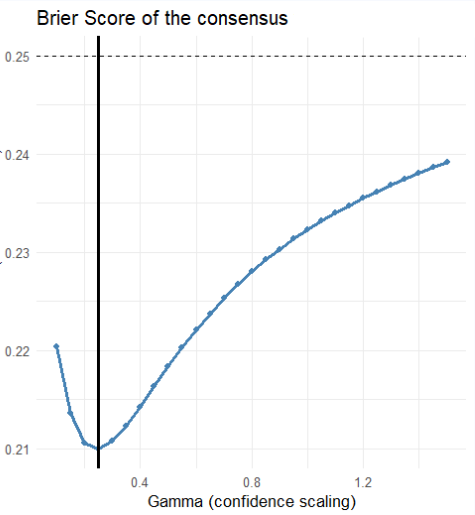

```{r setup}
#| include: false
library(gt)
library(tidyverse)
library(skimr)
library(ggthemes)
library(hrbrthemes)
library(rmarkdown)
library(DT)
library(dplyr)
library(readr)
library(purrr)
library(tibble)
library(ranger)  
library(stringr)
library(tidyr)
library(glmnet)
library(dplyr)
library(stringdist)
library(readr)
library(purrr)
library(tibble)
# library(randomForest)
library(stringr)
library(tidyr)
library(glmnet)
library(tidyverse)

# Feel free to revise this ggplot theme_set
theme_set(theme_ipsum()+
          theme(strip.background =element_rect(fill="lightgray"),
                axis.title.x = 
                  element_text(angle = 0,
                               size = rel(1.33),
                               margin = ggplot2::margin(10,0,0,0)),
                axis.title.y = 
                  element_text(angle = 90,
                               size = rel(1.33),
                               margin = ggplot2::margin(0,10,0,0))
                )
          )

get_model_predictors <- function() {
  c(
    #"WinPct", 
    "AvgPoints", "AvgOppPoints", 
    "FG2_Pct", "FG3_Pct", "FT_Pct", 
    #"ThreeP_Rate", 
    "OR_pg", "DR_pg", 
    #"Ast_pg", 
    "TO_pg", 
    #"Stl_pg", 
    #"Blk_pg", 
    #"PF_pg", 
    #"YearsNCAA", 
    "CareerTourneyWins",
    #"Momentum",
    "SOV",
    "AdjEM", "AdjOE", "AdjDE", "RankAdjEM",
    "AdjTempo"
  )
}
# Feel free to use below global options for color-blind-friendly scales
# scale_colour_discrete <- function(...) scale_colour_viridis_d(...)
# scale_fill_discrete <- function(...) scale_fill_viridis_d(...)
```

## This page is currently under construction

# Introduction

March Madness is an annual tournament for division 1 college basketball. I will be training prediction models to assign a probability to teams winning in a match up. One of the prediction models is derived from human-selected bracket data sourced from ESPN to compare the results of the machine learning models against.

The goal of this project is to find a way to fill out brackets which consistently outperforms both people and the other prediction models. If a model is able to consistently outperform people at filling out brackets, anyone who relies on that model will have an advantage.

## Research Question

The research question this project aims to answer is "How do NCAA March Madness prediction models perform relative to human-selected brackets?"

To answer this question, I will be evaluating each model on Brier-score, Log-loss, and Scored Simulated Brackets

# Background and Related Literature

The structure of March Madness is a 64 team, single elimination tournament.

Millions of people fill out brackets each year, attempting to predict which teams will move on to each round. Billions of dollars each year are gambled on the tournament.

# Data

## Data Source

Regular season performance data and bracket structure data: Kaggle

Advanced efficiency metrics: Kenpom

Public picks data: mRchmadness package, which scrapes data from ESPN

## Loading the data

There is a large number of csv files that could be useful for the analysis, so I load the data into a directory to pull each csv as needed

```{r}
#| echo: true
data_dir <- "csvs"

files <- list.files(
  data_dir,
  pattern = "\\.csv$",
  full.names = TRUE
)

data <- files %>%
  set_names(tools::file_path_sans_ext(basename(.))) %>%
  map(~ tryCatch(
    read_csv(.x, show_col_types = FALSE),
    error = function(e) {
      message("Error reading: ", .x)
      NULL
    }
  ))

kenpom_final <- data$kenpom_tournament_ready
```

The full data directory is shown in Appendix D

## Data summary

### Regular season stats

```{r}
#| echo: true
skim(data$MRegularSeasonDetailedResults)
```

### Advanced efficiency metrics

```{r}
#| echo: true
skim(data$INT_KenPom_Summary_Pre_Tourny)
```

### Public pick data

```{r}
#| echo: true
skim(data$"consensus1")
```

## Unit of Observation

Each observation of MRegularSeasonDetailedResults represents game-level data for each match-up in the regular season.

Each observation of INT_KenPom_Summary_Pre_Tourny represents team-level pre-tournament aggregate data

## Key Variables

The outcome variable we are predicting for is win probability, measured on a scale of 0 to 1

### The prediction Features:

WinPct= Win percentage

AvgPoints= Average points

AvgOppPoints= Average Opponent Points

FG2_Pct= two-point percentage

FG3_Pct= three-point percentage

FT_Pct= free-throw percentage

OR_pg= Offensive rebounds per game

DR_pg= Defensive rebounds per game

TO_pg= Turnovers per game

CareerTourneyWins= Coach's historical success in previous tournaments, measured in number of NCAA tournament games won.

AdjEM= Adjusted efficiency margin, the number of points a team is expected to outscore the average D-1 team over 100 possessions

SOV= Strength of victory, average AdjEM percentile of opponents that a team defeated

AdjOE= Adjusted offensive efficiency, sourced from kenpom, points scored per 100 possessions and adjusted for opponent.

AdjDE= Adjusted defensive efficiency, points allowed per 100 possessions and adjusted for opponent.

RankAdjEM= Ranked adjusted efficiency margin, the number ranking of each team's Adjusted efficiency margin each season

AdjTempo= Adjusted tempo, measured in possessions per 40 minutes and adjusted for opponent.

## Data Cleaning

### Preparing a data frame for all the prediction features

#### Creating the data frame team_season_stats from MRegularSeasonDetailedResults

```{r}
#| echo: true
rs <- data$MRegularSeasonDetailedResults

team_games <- bind_rows(
  rs %>%
    transmute(
      Season, DayNum,
      TeamID = WTeamID, OpponentID = LTeamID,
      Win = 1, NumOT,
      Points = WScore, OppPoints = LScore,
      FGM = WFGM, FGA = WFGA, FGM3 = WFGM3, FGA3 = WFGA3,
      FTM = WFTM, FTA = WFTA,
      OR = WOR, DR = WDR,
      Ast = WAst, TO = WTO,
      Stl = WStl, Blk = WBlk,
      PF = WPF
    ),
  rs %>%
    transmute(
      Season, DayNum,
      TeamID = LTeamID, OpponentID = WTeamID,
      Win = 0, NumOT,
      Points = LScore, OppPoints = WScore,
      FGM = LFGM, FGA = LFGA, FGM3 = LFGM3, FGA3 = LFGA3,
      FTM = LFTM, FTA = LFTA,
      OR = LOR, DR = LDR,
      Ast = LAst, TO = LTO,
      Stl = LStl, Blk = LBlk,
      PF = LPF
    )
)

team_season_stats <- team_games %>%
  group_by(Season, TeamID) %>%
  summarise(
    Games = n(),
    WinPct = mean(Win),
    AvgPoints = median(Points),
    AvgOppPoints = median(OppPoints),
    FG2_Pct = sum(FGM - FGM3) / sum(FGA - FGA3),
    FG3_Pct = sum(FGM3) / sum(FGA3),
    FT_Pct = sum(FTM) / sum(FTA),
    ThreeP_Rate = sum(FGA3) / sum(FGA),
    OR_pg = median(OR),
    DR_pg = median(DR),
    Ast_pg = median(Ast),
    TO_pg = median(TO),
    Stl_pg = median(Stl),
    Blk_pg = median(Blk),
    PF_pg = median(PF),
    AvgOT = mean(NumOT),
    .groups = "drop"
  )

# Filter to post-2002
team_season_stats <- team_season_stats %>%
  filter(Season >= 2003)
```

#### Creating SOV and CareerTourneyWins

```{r}
#| echo: true
# Strength of victories -----------------------------------------------------
# First, get the total number of teams per season for percentile calculation
teams_per_season <- kenpom_final %>%
  group_by(Season) %>%
  summarise(n_teams = n(), .groups = "drop")

# Prepare opponent KenPom ranks and join team count
opp_kenpom <- kenpom_final %>%
  select(Season, TeamID, Opp_RankAdjEM = RankAdjEM) %>%
  left_join(teams_per_season, by = "Season")

# Compute opponent percentile
opp_kenpom <- opp_kenpom %>%
  mutate(Opp_Percentile = (n_teams - Opp_RankAdjEM + 1) / n_teams) %>%
  select(Season, TeamID, Opp_Percentile)

# Join opponent percentiles to each game
team_games_with_opp <- team_games %>%
  left_join(opp_kenpom, by = c("Season", "OpponentID" = "TeamID"))

# Compute scaled SOV: average percentile of opponents that the team defeated
sov_scaled <- team_games_with_opp %>%
  filter(Win == 1) %>%
  group_by(Season, TeamID) %>%
  summarise(
    SOV_Scaled = mean(Opp_Percentile, na.rm = TRUE),
    .groups = "drop"
  )

# coach feature -----------------------------------------------------------
# Get all coach data from MTeamCoaches
all_coaches <- data$MTeamCoaches %>%
  select(Season, TeamID, CoachName) %>%
  distinct() %>%
  arrange(CoachName, Season)

# Get tournament wins for each coach-season
tourney_wins <- data$MNCAATourneyDetailedResults %>%
  # Get primary coach for the winning team
  inner_join(
    data$MTeamCoaches %>%
      mutate(DaysCoached = LastDayNum - FirstDayNum + 1) %>%
      group_by(Season, TeamID) %>%
      arrange(desc(DaysCoached)) %>%
      dplyr::slice(1) %>%
      ungroup() %>%
      select(Season, TeamID, PrimaryCoach = CoachName),
    by = c("Season", "WTeamID" = "TeamID")
  ) %>%
  # Count wins per primary coach per season
  group_by(PrimaryCoach, Season) %>%
  summarise(SeasonWins = n(), .groups = "drop") %>%
  rename(CoachName = PrimaryCoach)

# Calculate coach career statistics (using ALL historical data)
coach_career_stats <- all_coaches %>%
  select(CoachName, Season) %>%
  distinct() %>%
  left_join(tourney_wins, by = c("CoachName", "Season")) %>%
  mutate(SeasonWins = coalesce(SeasonWins, 0)) %>%
  arrange(CoachName, Season) %>%
  group_by(CoachName) %>%
  mutate(
    # Career wins BEFORE current season
    CareerTourneyWins = lag(cumsum(SeasonWins), default = 0),
    # Years coached BEFORE current season
    YearsNCAA = row_number() - 1,
    .groups = "drop"
  ) %>%
  select(CoachName, Season, YearsNCAA, CareerTourneyWins)

# Get primary coach for each team-season (for seasons >= 2003 to match team_season_stats)
primary_coaches <- data$MTeamCoaches %>%
  filter(Season >= 2003) %>%
  mutate(DaysCoached = LastDayNum - FirstDayNum + 1) %>%
  group_by(Season, TeamID) %>%
  arrange(desc(DaysCoached)) %>%
  dplyr::slice(1) %>%
  ungroup() %>%
  select(Season, TeamID, CoachName)


```

#### Left joining strength of victory, coach historical success, and Kenpom metrics to team season stats

```{r}
#| echo: true
team_season_stats <- team_season_stats %>%
  left_join(
    kenpom_final %>% 
      select(Season, TeamID, AdjEM, AdjOE, AdjDE, AdjTempo, RankAdjEM) %>%
      mutate(TeamID = as.integer(TeamID)),
    by = c("Season", "TeamID")
  )

team_season_stats <- team_season_stats %>%
  # Remove any existing coach columns if they exist
  select(-any_of(c("CoachName", "YearsNCAA", "CareerTourneyWins"))) %>%
  # Join with primary coaches
  left_join(primary_coaches, by = c("Season", "TeamID")) %>%
  # Join with career stats
  left_join(coach_career_stats, by = c("CoachName", "Season")) %>%
  # Fill NA values with 0
  mutate(
    YearsNCAA = coalesce(YearsNCAA, 0),
    CareerTourneyWins = coalesce(CareerTourneyWins, 0)
  )

team_season_stats <- team_season_stats %>%
  left_join(sov_scaled, by = c("Season", "TeamID")) %>%
  rename(SOV = SOV_Scaled)
```

Kenpom efficiency metrics had to be cleaned to be able to left join to team_season_stats (Appendix A)

#### Adding seed information

```{r}
# Get seed data and extract numeric seed value - SIMPLIFIED: only raw seed number
seed_data <- data$MNCAATourneySeeds %>%
  filter(Season >= 2003) %>%
  mutate(
    # Extract numeric seed (remove region letters)
    Seed_Num = as.numeric(str_extract(Seed, "\\d+"))
  )

# Join seed information with team_season_stats
team_season_stats <- team_season_stats %>%
  left_join(seed_data %>% select(Season, TeamID, Seed_Num),
            by = c("Season", "TeamID"))

# For teams that didn't make the tournament (no seed), fill with appropriate value
team_season_stats <- team_season_stats %>%
  mutate(
    Seed_Num = ifelse(is.na(Seed_Num), 17, Seed_Num)  # 17 = didn't make tournament
  )
```

#### Summary Statistics of team_season_stats

```{r summary-statistics}
#| echo: true
skim(team_season_stats)
```

## Cleaning Public Picks into a comparison model

This code provides the full pipeline from the original consensus picks data frame, which provides public pick data from ESPN, and converts into a model that compares teams for each year and decides win probability based on how often each team was picked. A more in depth explanation of this process can be found in the Empirical Methods section.

```{r}
#| include: FALSE

#debugging #the rendering literally breaks if i dont do this
print("CHECKPOINT BEFORE CHUNK 11")
print(names(team_season_stats))
stopifnot("Seed_Num" %in% names(team_season_stats))
```

```{r}
consensus1 <- (data$consensus1)
# FIX PLAY-IN GAMES-------------------------
consensus_2021_2026 <- consensus1 %>%
  select(year, name, round1, round2, round3, round4, round5, round6) %>%
  mutate(name = case_when(
    name == "MSM/Texas Southern" ~ "Texas Southern",
    name == "Michigan State/UCLA" ~ "UCLA",
    name == "NORF/APP" ~ "Norfolk St",
    name == "Wichita State/Drake" ~ "Drake",
    name == "AMCC/SMO" ~ "Texas A&M Corpus Christi",
    name == "ASU/NEV" ~ "Arizona St",
    name == "MSST/PITT" ~ "Pitt",
    name == "TXSO/FDU" ~ "FDU",
    TRUE ~ name
  ))

# CLEAN NAMES---------------------------
consensus_clean <- consensus_2021_2026 %>%
  mutate(TeamName = tolower(trimws(name)))

# SPELLINGS TABLE-------------------------------
spellings <- data$MTeamSpellings %>%
  mutate(TeamNameSpelling = tolower(trimws(
    iconv(TeamNameSpelling, from = "latin1", to = "UTF-8", sub = " ")
  ))) %>%
  group_by(TeamNameSpelling) %>%
  summarise(TeamID = first(TeamID), .groups = "drop")

# MANUAL TEAM MAPPINGS-------------------------------
manual_team_map <- c(
  # Louisiana Lafayette
  "louisiana lafayette" = 1418, "louisiana-lafayette" = 1418, "ull" = 1418,
  # Illinois Chicago
  "illinois chicago" = 1227, "illinois-chicago" = 1227, "uic" = 1227,
  # Texas A&M Corpus Christi
  "texas a&m corpus chris" = 1394, "texas a&m-corpus christi" = 1394,
  "a&m-corpus chris" = 1394, "texas a&m-cc" = 1394, "corpus christi" = 1394,
  "texas a&m corpus christi" = 1394, "texas a&m cc" = 1394,
  # Mississippi Valley State
  "mississippi valley st." = 1290, "mississippi valley state" = 1290, "miss valley st." = 1290,
  # Arkansas Pine Bluff
  "arkansas pine bluff" = 1115, "ark pine bluff" = 1115, "uapb" = 1115,
  # Arkansas Little Rock
  "arkansas little rock" = 1114, "ark little rock" = 1114, "ualr" = 1114,
  "little rock" = 1114, "ar-little rock" = 1114,
  # Cal State Bakersfield
  "cal st. bakersfield" = 1167, "cal state bakersfield" = 1167,
  "csu bakersfield" = 1167, "cs bakersfield" = 1167, "bakersfield" = 1167,
  # Southeast Missouri State
  "southeast missouri st." = 1369, "southeast missouri state" = 1369,
  "se missouri st" = 1369, "se missouri state" = 1369, "semo" = 1369,
  # Texas State
  "texas state" = 1402, "texas st." = 1402, "southwest texas st." = 1402, "southwest texas state" = 1402,
  # UT Rio Grande Valley
  "ut rio grande valley" = 1410, "texas-rio grande valley" = 1410, "utrgv" = 1410,
  "texas pan american" = 1410, "texas-pan american" = 1410,
  # IUPUI / IU Indy
  "iupui" = 1237, "iu indy" = 1237, "indianapolis" = 1237,
  # LIU
  "liu" = 1254, "long island" = 1254, "long island university" = 1254, "liu brooklyn" = 1254,
  # Queens
  "queens" = 1474, "queens nc" = 1474, "queens university" = 1474,
  # Saint Francis (NY)
  "st. francis ny" = 1383, "st francis ny" = 1383, "saint francis ny" = 1383,
  "st. francis (ny)" = 1383, "saint francis (ny)" = 1383,
  # Saint Francis (PA) - CORRECTED to 1384
  "st. francis pa" = 1384, "st francis pa" = 1384, "saint francis pa" = 1384,
  "st. francis (pa)" = 1384, "saint francis (pa)" = 1384,
  # Green Bay
  "green bay" = 1453, "wisconsin green bay" = 1453, "wisconsin-green bay" = 1453,
  # Milwaukee
  "milwaukee" = 1454, "wisconsin milwaukee" = 1454, "wisconsin-milwaukee" = 1454,
  # Utah Tech / Dixie State
  "utah tech" = 1469, "dixie st." = 1469, "dixie state" = 1469,
  # Texas A&M Commerce
  "texas a&m commerce" = 1477, "tx a&m commerce" = 1477, "east texas a&m" = 1477,
  # Missouri State
  "missouri state" = 1283, "missouri st." = 1283, "southwest missouri st." = 1283,
  # McNeese
  "mcneese" = 1270, "mcneese st." = 1270, "mcneese state" = 1270,
  # Nicholls
  "nicholls" = 1311, "nicholls st." = 1311, "nicholls state" = 1311,
  # Troy
  "troy" = 1407, "troy st." = 1407,
  # Utah Valley
  "utah valley" = 1430, "utah valley st." = 1430, "utah valley state" = 1430,
  # Detroit Mercy
  "detroit mercy" = 1178, "detroit" = 1178, "detroit-mercy" = 1178,
  # SIU Edwardsville
  "siue" = 1188, "siu edwardsville" = 1188, "southern illinois edwardsville" = 1188,
  # UMKC / Kansas City
  "umkc" = 1282, "kansas city" = 1282, "missouri-kansas city" = 1282,
  # Purdue Fort Wayne
  "purdue fort wayne" = 1236, "ipfw" = 1236, "fort wayne" = 1236, "pfw" = 1236,
  # Charleston
  "charleston" = 1158, "college of charleston" = 1158,
  # CSUN (Cal State Northridge)
  "csun" = 1169, "cal st. northridge" = 1169, "cal state northridge" = 1169,
  # Middle Tennessee - FIXED to 1292 (not conflicting with CSUN)
  "middle tennessee" = 1292, "middle tennessee st." = 1292, "mtsu" = 1292, "mid tennessee" = 1292,
  # Louisiana Monroe
  "louisiana monroe" = 1419,
  # Additional tournament-relevant teams (ALL IDs CORRECTED)
  "bethune-cookman" = 1398,
  "maryland - e. shore" = 1271,  # Maryland Eastern Shore
  "tarleton st" = 1470,
  "tarleton state" = 1470,
  "st. thomas" = 1472,
  "winston salem st." = 1445,
  "tennessee martin" = 1404,  # UT Martin
  # New additions
  "abil christian" = 1101, "abilene christian" = 1101,
  "fsu" = 1199, "florida state" = 1199,
  "osu" = 1326, "ohio state" = 1326,
  "uva" = 1438, "virginia" = 1438,
  "csu fullerton" = 1168, "cs fullerton" = 1168,
  "j'ville st" = 1240, "jacksonville st." = 1240,
  "miami" = 1274, "miami fl" = 1274,
  "fau" = 1194, "florida atlantic" = 1194,
  "kennesaw st" = 1244, "kennesaw state" = 1244,
  "western ky" = 1443, "western kentucky" = 1443,
  "mount st marys" = 1291, "mount st. marys" = 1291,
  # Extras (ALL IDs CORRECTED)
  "cal" = 1143,
  "saint joe's" = 1386,
  "south dakota st" = 1355,
  "ksu" = 1243,
  "msm" = 1291,
  "uri" = 1348
)

# CONVERT TO DATAFRAME-------------------------------
manual_mappings <- data.frame(
  TeamName = names(manual_team_map),
  TeamID = as.integer(manual_team_map),
  stringsAsFactors = FALSE
) %>%
  distinct(TeamName, .keep_all = TRUE)

# EXACT MATCH-------------------------------
exact_consensus <- consensus_clean %>%
  left_join(spellings, by = c("TeamName" = "TeamNameSpelling")) %>%
  filter(!is.na(TeamID))

# MANUAL MATCH-------------------------------
manual_consensus <- consensus_clean %>%
  anti_join(exact_consensus, by = "TeamName") %>%
  left_join(manual_mappings, by = "TeamName") %>%
  filter(!is.na(TeamID))

# FINAL LOOKUP-------------------------------
consensus_with_ids <- bind_rows(exact_consensus, manual_consensus)

# SAFETY CHECK-------------------------------
missing_ids <- consensus_clean %>%
  anti_join(consensus_with_ids, by = c("year", "name", "round1", "round2", "round3", "round4", "round5", "round6", "TeamName"))

if(nrow(missing_ids) > 0){
  cat("WARNING: These teams are still missing TeamIDs:\n")
  print(missing_ids %>% select(year, name, TeamName) %>% distinct())
  stop("ERROR: Some teams are still missing TeamIDs")
} else {
  cat("all teams successfully matched with TeamIDs")
}


# READY FOR MODELING-------------------------------
df <- consensus_with_ids %>%
  mutate(across(starts_with("round"), as.numeric))

# 1. BUILD TEAM STRENGTH (FROM ROUND PROBS)-------------------------------
df_strength <- df %>%
  mutate(
    strength =
      1  * round1 +
      2  * round2 +
      4  * round3 +
      8  * round4 +
      16 * round5 +
      32 * round6
  ) %>%
  group_by(year) %>%
  mutate(
    # normalize within season
    strength = strength / max(strength, na.rm = TRUE)
  ) %>%
  ungroup()


# 2. CONVERT TO ELO-STYLE RATING-------------------------------
df_strength <- df_strength %>%
  mutate(
    elo = 1500 + 400 * log(strength + 1e-6)
  )

# 3. CREATE ALL PAIRWISE MATCHUPS -------------------------------
pairwise_probs <- df_strength %>%
  select(year, TeamID, elo) %>%
  group_by(year) %>%
  group_modify(~{
    
    teams <- .x
    
    expand_grid(
      TeamA = teams$TeamID,
      TeamB = teams$TeamID
    ) %>%
      filter(TeamA != TeamB) %>%
      
      # Join Team A
      left_join(teams, by = c("TeamA" = "TeamID")) %>%
      rename(elo_A = elo) %>%
      
      # Join Team B
      left_join(teams, by = c("TeamB" = "TeamID")) %>%
      rename(elo_B = elo) %>%
      
      # 4. ELO WIN PROBABILITY-------------------------------
    mutate(
      matchup_prob = 1 / (1 + 10 ^ ((elo_B - elo_A) / 500)) #decreasing the divisor of the elo makes the model more overconfident
    )
    
  }) %>%
  ungroup()
```

### Final model data frame

```{r}
#| echo: true
pairwise_lookup <- pairwise_probs %>%
  select(year, TeamA, TeamB, matchup_prob)

#write_csv(pairwise_lookup, "pairwise_lookup.csv")
```

# Empirical Strategy / Methods

## Machine learning models

### Linear regression

For linear regression, we use the first two principle components resulting from the principal component analysis of the predictor variables.

$$Probability_{i} = \beta_0 + \beta_1 PC_1 X_{i} + \beta_2 PC_2 X_{i} + \varepsilon_{i}$$

where $Probability_{i}$ is the outcome of win probability for unit $i$, $PC_1X_{it}$ is the first principal component of the predictor variables, $PC_2X_{it}$ is the second explanatory of the predictor variables, and $\varepsilon_{i}$ is the error term.

We cap the maximum probability at 1 and the minimum at 0

### Logistic regression

$$p(Y=1 \mid X_1, X_2)
=
\frac{1}{1 + \exp\left(-\left(\beta_0 + \sum_{j=1}^p \beta_j (X_{j,1} - X_{j,2})\right)\right)}$$

$X_{j,1}$ and $X_{j,2}$ are team-level stats for team 1 and team 2.

We transform the linear predictor into probabilities between 0 and 1 using the logistic function.

### Random Forest

### Elastic Net

### Training the models

For each year the model is to predict, the model gets retrained on all previous years.

## Public Picks (comparison model)

```{r}
#| echo: true
data$"Public Picks" %>% 
  head(5)
```

The public pick data needs to be converted from frequency of teams picked to each round into probability of team A beating team B.

We calculate a raw strength value based on the frequency a team was picked to each round of the tournament using the following formula:

$$Strength = r_1 + 2r_2 + 4r_3 + 8r_4 + 16r_5 + 32r_6$$

We normalize the strength to each season by dividing each strength value by the highest strength value for the given year. $$Strength_{\mathrm{norm}} = \frac{Strength}{\max(Strength)}$$

We convert the normalized strength value into an ELO metric

$$\mathrm{ELO} = 1500 + 400\ln\left(Strength_{\mathrm{norm}} + 10^{-6}\right)$$

We finally compare the ELO of two teams to determine the probability a given team wins

$$P(\text{A beats B}) = \frac{1}{1 + 10^{\frac{ELO_B - ELO_A}{500}}}$$

Where $A$ refers to team A, and $B$ refers to team B.

## Evaluation methodology

### Brier Score:

$$\text{Brier Score} = \frac{1}{N}\sum_{i=1}^{N}(p_i - o_i)^2$$

$p_i$ = predicted probability

$o_i$ = observed outcome (0 for a loss, 1 for a win)

$N$ = number of predictions

Brier score is essentially an average mean score error on model predictions

### Log-Loss:

$$\text{Log Loss} = -\frac{1}{N}\sum_{i=1}^{N}\left[o_i\log(p_i) + (1-o_i)\log(1-p_i)\right]$$

$p_i$ = predicted probability

$o_i$ = observed outcome (0 for a loss, 1 for a win)

$N$ = number of predictions

Log-loss measures how wrong each model is on average. Models score exponentially worse when they are more confident in a wrong prediction.

### Simulated Brackets

To evaluate the models on simulated brackets, first we run simulations with the following method:

$$Y_{g,b} \sim \operatorname{Bernoulli}(p_{g,b}), \qquad g=1,\dots,63,\ b=1,\dots,100$$

$Y_{g,b}$ = the simulated outcome of game $g$ in bracket simulation $b$

$Bernoulli(p_{g,b})$ = a random draw with probability $p_{g,b}​$

$$B_b = \{Y_{1,b},Y_{2,b},\dots,Y_{63,b}\}$$

$B_b$ = one complete simulated tournament bracket with all random draws chosen for all 63 games

These simulation are run 100 times

#### Scoring brackets

The brackets are scored on the following formula:

$$S({B}) = \sum_{r=1}^{6} w_r C_r$$

$$(w_1,w_2,w_3,w_4,w_5,w_6) = (1,1,2,3,5,8)$$

$S(B)$ = Total score for bracket $B$

$C_r$ = Total number of correct picks for round $r$

$w_r$ = point value for round $r$, ranging from 1 point for the first round up to 8 points for the championship game

This gives a score for each bracket each model generates, which we can use to compare to other models

# Results

## PCA analysis

```{r}
#| echo: true
pca_base <- team_season_stats %>%
  filter(Seed_Num <= 16) %>%
  select(Season, TeamID, all_of(get_model_predictors())) %>%
  drop_na()

pca_model <- prcomp(
  pca_base %>% select(-Season, -TeamID),
  scale. = TRUE,
  center = TRUE
)

#check bindings
pca_model$rotation

pca_scores <- bind_cols(
  pca_base %>% select(Season, TeamID),
  as.data.frame(pca_model$x)
)

pca_scores %>%
  filter(Season >= 2021, Season <= 2026) %>%
  left_join(
    team_season_stats %>% select(Season, TeamID, Seed_Num),
    by = c("Season", "TeamID")
  ) %>%
  mutate(is_one_seed = ifelse(Seed_Num == 1, "1 Seed", "Other Seed")) %>%
  ggplot(aes(PC1, PC2)) +
  geom_point(
    aes(color = Seed_Num, shape = is_one_seed),
    alpha = 0.8,
    size = 2.5
  ) +
  facet_wrap(~ Season) +
  scale_shape_manual(values = c("1 Seed" = 8, "Other Seed" = 16)) +
  scale_color_viridis_c(option = "plasma") +
  labs(
    title = "PCA of Tournament Teams by Year",
    subtitle= "One seeds are starred",
    shape = "Seed Type",
    color = "Seed Number"
  ) +
  theme_minimal()
```

### Variance explained

```{r}
#| echo: true
year <- "2025" #model is subject to change depending on the year

# variance explained
var_explained <- pca_model$sdev^2
prop_var_explained <- var_explained / sum(var_explained)

variance_df <- data.frame(
  PC = paste0("PC", seq_along(prop_var_explained)),
  Variance_Explained = prop_var_explained,
  Cumulative = cumsum(prop_var_explained)
)
pc12_df <- data.frame(
  Component = c("PC1", "PC2"),
  Variance_Explained = prop_var_explained[1:2],
  Cumulative = cumsum(prop_var_explained[1:2])
)

pc12_df %>% gt()
```

## Brier score results

```{r results-table}
p1 <- ggplot(data$comparison, aes(x = Evaluation_Year, y = Brier_Score, color = Model)) +
  geom_line(size = 1) +
  geom_point() +
  #geom_smooth(method=lm, se=F)+
  labs(title = "Model brier score comparison",
       y = "Brier Score (lower is better)",
       x = "Evaluation Year") +
  theme_minimal()
#baseline is .25 for 50/50
p1+scale_color_viridis_d()
```

## Log-loss results

```{r results-figure}
p2 <- ggplot(data$comparison, aes(x = Evaluation_Year, y = LogLoss, color = Model)) +
  geom_line(size = 1) +
  geom_point() +
  labs(title = "Model Log Loss Comparison",
       y = "Log Loss (lower is better)",
       x = "Evaluation Year") +
  theme_minimal()

p2+scale_color_viridis_d()
```

## Bracket simulation results

```{r}
q3_lines <- data$combined_scores %>%
  group_by(Year, Model) %>%
  summarise(Q3 = quantile(TotalPoints, 0.75), .groups = "drop") %>%
  group_by(Year) %>%
  slice_max(Q3, n = 1, with_ties = FALSE) %>%
  ungroup()

# Faceted boxplot by year
ggplot(data$combined_scores, aes(x = Model, y = TotalPoints, fill = Model)) +
  geom_boxplot() +
  
  geom_hline(
    data = q3_lines,
    aes(yintercept = Q3),
    color = "red",
    linetype = "dotted",
    linewidth = 1,
    alpha=.5
  ) +
  
  facet_wrap(~Year, ncol = 3, scales = "free_y") +
  labs(
    title = "Bracket Scores by Model (2021-2025)",
    subtitle = paste("Best model 3rd quartile denoted by red dotted line"),
    y = "Total Points",
    x = "Model"
  ) +
  theme_minimal() +
  theme(
    axis.text.x = element_text(angle = 45, hjust = 1),
    strip.background = element_rect(fill = "lightgray", color = NA),
    strip.text = element_text(size = 12, face = "bold")
  )+
  scale_fill_viridis_d()
```

These results are further explained by championship accuracies:

```{r}
combined_champs<- data$champion_predictions_all_models2

year_summary <- combined_champs %>%
  group_by(Year, Model) %>%
  summarise(
    Accuracy = mean(Correct, na.rm = TRUE) * 100,
    Correct = sum(Correct, na.rm = TRUE),
    Total = n(),
    .groups = "drop"
  )

cat("\n", paste(rep("=", 60), collapse = ""), "\n")
cat("ACCURACY BY YEAR\n")
cat(paste(rep("=", 60), collapse = ""), "\n")
print(year_summary)

# Plot 1: Champion accuracy by model and year (all 5 models)
# Use year_summary instead of accuracy_summary for faceted plot
year_summary <- year_summary %>%
  mutate(Model = ifelse(Model == "Ranger", "Random_Forest", Model))

p2_faceted <- ggplot(year_summary, aes(x = reorder(Model, Accuracy), y = Accuracy, fill = Model)) +
  geom_bar(stat = "identity") +
  geom_text(aes(label = paste0(round(Accuracy, 1), "%\n")), 
            hjust = -0.1, size = 3) +
  coord_flip() +
  facet_wrap(~Year, ncol = 2, scale="free_x") +
  labs(
    title = "Champion Prediction Accuracy by Model and Year",
    x = "Model",
    y = "Accuracy (%)"
  ) +
  theme_minimal() +
  theme(legend.position = "none",
        axis.text.x = element_text(angle = 45, hjust = 1))

print(p2_faceted+scale_fill_viridis_d())

# Plot 2: Overall accuracy bar chart (all 5 models)
accuracy_summary <- data$accuracy_summary_all_models2 %>%
  mutate(Model = ifelse(Model == "Ranger", "Random_Forest", Model))

p2 <- ggplot(accuracy_summary, aes(x = reorder(Model, Accuracy), y = Accuracy, fill = Model)) +
  geom_bar(stat = "identity") +
  geom_text(aes(label = paste0(round(Accuracy, 1), "%\n(", Correct, "/", Total, ")")), 
            hjust = -0.1, size = 4) +
  coord_flip() +
  labs(
    title = "Overall Champion Prediction Accuracy by Model",
    x = "Model",
    y = "Accuracy (%)"
  ) +
  theme_minimal() +
  theme(legend.position = "none") +
  ylim(0, max(accuracy_summary$Accuracy, na.rm = TRUE) + 10)

print(p2+scale_fill_viridis_d())

# Optional: Save results
#   write.csv(combined_champs, "champion_predictions_all_models2.csv", row.names = FALSE)
#   write.csv(accuracy_summary, "accuracy_summary_all_models2.csv", row.names = FALSE)
```

# Discussion and Implications

## PCA and Linear Regression analysis

## Brier Score and Log-loss analysis

All of the machine learning models vary in brier score by about .02 year to year, which is a minimal difference. The public consensus model is the only model that performs significantly worse than the others for most years. Log-loss shows similar results. Besides the linear regression model performing significantly worse in 2022 and 2023 (Likely due to an extremely overconfident prediction), The public consensus model again performs significantly worse than the machine learning models. Appendix B examines the overconfidence issue in the public consensus model further, however I opted not to adjust the model for bracket simulations because the un-adjusted model outperforms the adjusted model in bracket selection.

## Bracket simulation analysis

# Conclusion

Summarize your research question, data, method, main findings, and key takeaway.

Briefly suggest possible future extensions.

# References

Shayer, E., & Powers, S. (2017). *mRchmadness: Numerical tools for filling out an NCAA basketball tournament bracket* (Version 1.0.0) \[R package\]. CRAN. https://CRAN.R-project.org/package=mRchmadness. Accessed 4/26/2026.

# Appendix

## Appendix A

### Kenpom Cleaning

```{r}
#| execute: FALSE

# --- 1. LOAD KENPOM DATA WITH ALL STATS ---
kenpom1 <- data$INT_KenPom_Summary_Pre_Tourny %>%
  select(Season, TeamName, AdjEM, RankAdjEM, AdjOE, AdjDE, AdjTempo) %>%
  mutate(TeamName = tolower(trimws(TeamName)))

#---------- 2026 years kenpom
kenpom2 <- data$INT_KenPom_Summary_2026 %>% 
  select(Season, TeamName, AdjEM, RankAdjEM, AdjOE, AdjDE, AdjTempo) %>%
  filter(Season==2026) %>% 
  mutate(TeamName = tolower(trimws(TeamName)))

kenpom <- bind_rows(kenpom1,kenpom2)

# Load spellings and team info
spellings <- data$MTeamSpellings %>%
  mutate(TeamNameSpelling = tolower(trimws(
    iconv(TeamNameSpelling, from = "latin1", to = "UTF-8", sub = " ")
  ))) %>%
  distinct(TeamNameSpelling, .keep_all = TRUE)

# --- 2. COMPREHENSIVE MANUAL MAPPINGS ---
# These handle all known name variations and historical name changes
manual_mappings <- data.frame(
  TeamName = c(
    # Louisiana Lafayette variations
    "louisiana lafayette", "louisiana-lafayette", "ull",
    # Illinois Chicago variations
    "illinois chicago", "illinois-chicago", "uic",
    # Texas A&M Corpus Christi
    "texas a&m corpus chris", "texas a&m-corpus christi", "a&m-corpus chris", "texas a&m-cc", "corpus christi",
    # Mississippi Valley State
    "mississippi valley st.", "mississippi valley state", "miss valley st.",
    # Arkansas Pine Bluff
    "arkansas pine bluff", "ark pine bluff", "uapb",
    # Arkansas Little Rock
    "arkansas little rock", "ark little rock", "ualr", "little rock",
    # Cal State Bakersfield
    "cal st. bakersfield", "cal state bakersfield", "csu bakersfield", "cs bakersfield", "bakersfield",
    # Southeast Missouri State
    "southeast missouri st.", "southeast missouri state", "se missouri st", "se missouri state", "semo",
    # Texas State
    "texas state", "texas st.", "southwest texas st.", "southwest texas state",
    # UT Rio Grande Valley
    "ut rio grande valley", "texas-rio grande valley", "utrgv", "texas pan american", "texas-pan american",
    # IUPUI / IU Indy
    "iupui", "iu indy", "indianapolis",
    # LIU
    "liu", "long island", "long island university", "liu brooklyn",
    # Queens
    "queens", "queens nc", "queens university",
    # Saint Francis (NY)
    "st. francis ny", "st francis ny", "saint francis ny", "st. francis (ny)", "saint francis (ny)",
    # Saint Francis (PA)
    "st. francis pa", "st francis pa", "saint francis pa", "st. francis (pa)", "saint francis (pa)",
    # Green Bay
    "green bay", "wisconsin green bay", "wisconsin-green bay",
    # Milwaukee
    "milwaukee", "wisconsin milwaukee", "wisconsin-milwaukee",
    # Utah Tech / Dixie State
    "utah tech", "dixie st.", "dixie state",
    # Texas A&M Commerce
    "texas a&m commerce", "tx a&m commerce", "east texas a&m",
    # Missouri State
    "missouri state", "missouri st.", "southwest missouri st.",
    # McNeese
    "mcneese", "mcneese st.", "mcneese state",
    # Nicholls
    "nicholls", "nicholls st.", "nicholls state",
    # Troy
    "troy", "troy st.",
    # Utah Valley
    "utah valley", "utah valley st.", "utah valley state",
    # Detroit Mercy
    "detroit mercy", "detroit", "detroit-mercy",
    # SIU Edwardsville
    "siue", "siu edwardsville", "southern illinois edwardsville",
    # UMKC / Kansas City
    "umkc", "kansas city", "missouri-kansas city",
    # Purdue Fort Wayne
    "purdue fort wayne", "ipfw", "fort wayne", "pfw",
    # Charleston
    "charleston", "college of charleston",
    # CSUN
    "csun", "cal st. northridge", "cal state northridge",
    # Middle Tennessee
    "middle tennessee", "middle tennessee st.", "mtsu",
    # Additional tournament-relevant teams
    "louisiana monroe", "st francis (pa)", "bethune-cookman", 
    "maryland - e. shore", "tarleton st", "tarleton state",
    "st. thomas", "tarleton st.", "winston salem st.", "tennessee martin"
  ),
  TeamID = c(
    rep(1418, 3), rep(1227, 3), rep(1394, 5), rep(1290, 3),
    rep(1115, 3), rep(1114, 4), rep(1167, 5), rep(1369, 5),
    rep(1402, 4), rep(1410, 5), rep(1237, 3), rep(1254, 4),
    rep(1474, 3), rep(1383, 5), rep(1382, 5),
    rep(1453, 3), rep(1454, 3), rep(1469, 3), rep(1477, 3),
    rep(1283, 3), rep(1270, 3), rep(1311, 3), rep(1407, 2),
    rep(1430, 3), rep(1178, 3), rep(1188, 3), rep(1282, 3),
    rep(1236, 4), rep(1158, 2), rep(1169, 3), rep(1292, 3),
    # Additional IDs
    1398, 1384, 1126, 1271, 1470, 1470, 1384, 1468, 1475, 1404
  ),
  stringsAsFactors = FALSE
) %>%
  distinct(TeamName, .keep_all = TRUE)

# --- 3. EXACT MATCHES ---
exact <- kenpom %>%
  left_join(spellings, by = c("TeamName" = "TeamNameSpelling")) %>%
  filter(!is.na(TeamID)) %>%
  mutate(method = "exact")

# --- 4. MANUAL MATCHES (apply first) ---
manual <- kenpom %>%
  filter(TeamName %in% manual_mappings$TeamName) %>%
  left_join(manual_mappings, by = "TeamName") %>%
  mutate(method = "manual")

# --- 5. FUZZY MATCH FOR REMAINING ---
already_matched <- unique(c(exact$TeamName, manual$TeamName))
fuzzy_candidates <- kenpom %>%
  filter(!TeamName %in% already_matched) %>%
  distinct(TeamName) %>%
  pull(TeamName)

fuzzy_list <- list()
for (team in fuzzy_candidates) {
  dists <- stringdist(team, spellings$TeamNameSpelling, method = "jw")
  best <- which.min(dists)
  if (dists[best] <= 0.2) {
    # Get the matched spelling and TeamID
    matched_spelling <- spellings$TeamNameSpelling[best]
    matched_id <- spellings$TeamID[best]
    
    # Retrieve the full KenPom row for that team (Season, AdjEM, RankAdjEM, AdjOE, AdjDE, AdjTempo)
    full_row <- kenpom %>% filter(TeamName == team)
    if (nrow(full_row) > 0) {
      fuzzy_list[[team]] <- full_row %>%
        mutate(
          TeamID = matched_id,
          matched_spelling = matched_spelling,
          dist = dists[best],
          method = "fuzzy"
        )
    }
  }
}
fuzzy <- bind_rows(fuzzy_list)

# --- 6. COMBINE ALL MATCHES ---
# Join back to full KenPom data (keeping all stats including RankAdjEM)
kenpom_final <- bind_rows(
  exact %>% select(Season, TeamName, AdjEM, RankAdjEM, AdjOE, AdjDE, AdjTempo, TeamID, method),
  manual %>% select(Season, TeamName, AdjEM, RankAdjEM, AdjOE, AdjDE, AdjTempo, TeamID, method),
  fuzzy %>% select(Season, TeamName, AdjEM, RankAdjEM, AdjOE, AdjDE, AdjTempo, TeamID, method)
) %>%
  distinct(Season, TeamID, .keep_all = TRUE) %>%   # one row per team-season
  arrange(Season, TeamID)

# --- 8. FINAL VERIFICATION ---
cat("\n", strrep("=", 60), "\n")
cat("FINAL KENPOM DATASET\n")
cat(strrep("=", 60), "\n")
cat("Rows:", nrow(kenpom_final), "\n")
cat("Unique teams:", n_distinct(kenpom_final$TeamID), "\n")
cat("Seasons:", min(kenpom_final$Season, na.rm=TRUE), "-", max(kenpom_final$Season, na.rm=TRUE), "\n")

# Verify tournament teams (2003+)
tourney_teams <- data$MNCAATourneySeeds %>%
  filter(Season >= 2003) %>%
  distinct(TeamID) %>%
  pull(TeamID)

missing <- setdiff(tourney_teams, kenpom_final$TeamID)
if (length(missing) == 0) {
  cat("\n✅ TOURNAMENT TEAMS (2003+): ALL", length(tourney_teams), "PRESENT\n")
} else {
  cat("\n⚠️ Missing tournament teams:", length(missing), "\n")
  cat("Missing IDs:", paste(missing, collapse = ", "), "\n")
}
```

## Appendix B

### Overconfidence findings in the public consensus model

When evaluating the public consensus model, I found that it was consistently overconfident in its predictions. Initially, I applied a transformation to the consensus model, scaling it to be more under confident in all predictions.

The following is a graph showing the results of scaling public consensus:

{width="340"}

However, despite finding that public picks was overconfident and that scaling the probabilities saw a better brier score outcome, adjusting this overconfidence led to a decrease in scores during the bracket simulation across all years.

## Appendix C

### C.1 Functions for generating brier score, log-loss, and simulated brackets

#### Bracket simulation function

```{r}
# model predictors function --------------------------------------
get_model_predictors <- function() {
  c(
    #"WinPct", 
    "AvgPoints", "AvgOppPoints", 
    "FG2_Pct", "FG3_Pct", "FT_Pct", 
    #"ThreeP_Rate", 
    "OR_pg", "DR_pg", 
    #"Ast_pg", 
    "TO_pg", 
    #"Stl_pg", 
    #"Blk_pg", 
    #"PF_pg", 
    #"YearsNCAA", 
    "CareerTourneyWins",
    #"Momentum",
    "SOV",
    "AdjEM", "AdjOE", "AdjDE", "RankAdjEM",
    "AdjTempo"
  )
}

#Get bracket structure for simulation----------
get_bracket_structure <- function(season, data) {
  
  # Get seeds for the season
  seeds <- data$MNCAATourneySeeds %>%
    filter(Season == season)
  
  # Get slot structure
  slots <- data$MNCAATourneySlots %>%
    filter(Season == season)
  
  # Get round mapping
  round_map <- data$MNCAATourneySeedRoundSlots %>%
    select(GameSlot, GameRound) %>%
    distinct()
  
  # Join to get rounds
  slots_with_rounds <- slots %>%
    left_join(round_map, by = c("Slot" = "GameSlot")) %>%
    arrange(GameRound)
  
  # Create a lookup for seeds to team IDs
  seed_to_team <- seeds %>%
    select(Seed, TeamID) %>%
    deframe()
  
  # For each slot, determine the teams (where possible)
  result <- slots_with_rounds %>%
    rowwise() %>%
    mutate(
      # StrongSeed is always a seed
      Team1 = seed_to_team[StrongSeed],
      
      # WeakSeed could be a seed OR a slot reference
      Team2 = ifelse(
        WeakSeed %in% names(seed_to_team),
        seed_to_team[WeakSeed],
        NA_integer_  # Slot reference - will be filled during simulation
      )
    ) %>%
    ungroup()
  
  # Return ALL slots
  result %>%
    select(Season, Slot, Team1, Team2, GameRound, StrongSeed, WeakSeed)
}

# Modified bracket_year for historical use (when you need actual results)
bracket_year_historical <- function(season, data) {
  
  seeds <- data$MNCAATourneySeeds %>%
    filter(Season == season)
  
  results <- data$MNCAATourneyCompactResults %>%
    filter(Season == season)
  
  round_map <- data$MNCAATourneySeedRoundSlots %>%
    select(GameSlot, GameRound) %>%
    distinct()
  
  slots <- data$MNCAATourneySlots %>%
    filter(Season == season) %>%
    left_join(round_map, by = c("Slot" = "GameSlot")) %>%
    arrange(GameRound)
  
  resolve_slot <- function(slot_name, winners) {
    if (slot_name %in% names(winners)) {
      return(winners[[slot_name]])
    }
    team <- seeds %>%
      filter(Seed == slot_name) %>%
      pull(TeamID)
    if (length(team) == 0) NA_integer_ else team
  }
  
  winners <- list()
  games <- vector("list", nrow(slots))
  
  for (i in seq_len(nrow(slots))) {
    slot <- slots$Slot[i]
    team1 <- resolve_slot(slots$StrongSeed[i], winners)
    team2 <- resolve_slot(slots$WeakSeed[i], winners)
    
    res <- results %>%
      filter(WTeamID %in% c(team1, team2), LTeamID %in% c(team1, team2))
    
    winner <- if (nrow(res) > 0) res$WTeamID[1] else NA_integer_
    winners[[slot]] <- winner
    
    games[[i]] <- tibble(
      Season = season,
      Slot = slot,
      StrongSeed = slots$StrongSeed[i],  
      WeakSeed = slots$WeakSeed[i],   
      Team1 = team1,
      Team2 = team2,
      Winner = winner,
      GameRound = slots$GameRound[i]
    )
  }
  
  bind_rows(games) %>%
    arrange(GameRound) %>% 
    filter(GameRound != 0)
}

#build training data function ------
build_training_data_balanced <- function(
    data,
    team_season_stats,
    start_season = 2003,
    train_until_season
) {
  
  # 1. Get tournament games
  tourney_games <- data$MNCAATourneyCompactResults %>%
    filter(
      Season >= start_season,
      Season < train_until_season,
      Season != 2020
    ) %>%
    select(Season, WTeamID, LTeamID)
  
  # 2. Randomly choose orientation for each game
  set.seed(123)  # For reproducibility
  
  games <- tourney_games %>%
    rowwise() %>%
    mutate(
      # Random coin flip: TRUE = winner is Team1, FALSE = loser is Team1
      winner_as_team1 = sample(c(TRUE, FALSE), 1),
      
      # Set Team1, Team2, and Win accordingly
      Team1 = ifelse(winner_as_team1, WTeamID, LTeamID),
      Team2 = ifelse(winner_as_team1, LTeamID, WTeamID),
      Win   = ifelse(winner_as_team1, 1, 0)   # 1 if Team1 is the actual winner
    ) %>%
    ungroup() %>%
    select(Season, Team1, Team2, Win)
  
  # 3. Join Team1 stats
  all_stats_cols <- setdiff(names(team_season_stats), c("Season", "TeamID"))
  
  games <- games %>%
    left_join(
      team_season_stats %>% 
        select(Season, TeamID, all_of(all_stats_cols)),
      by = c("Season", "Team1" = "TeamID")
    ) %>%
    rename_with(~ paste0(.x, "_1"), .cols = all_of(all_stats_cols))
  
  # 4. Join Team2 stats
  games <- games %>%
    left_join(
      team_season_stats %>% 
        select(Season, TeamID, all_of(all_stats_cols)),
      by = c("Season", "Team2" = "TeamID")
    ) %>%
    rename_with(~ paste0(.x, "_2"), .cols = all_of(all_stats_cols))
  
  # 5. Drop rows with missing stats 
  #  games <- games %>%
  #    drop_na()
  #comment this out for now since it should fail if there are NA's
  
  # 6. Build difference features for numeric predictors
  predictors <- get_model_predictors()  # list of base stat names
  
  diff_list <- list()
  for(pred in predictors){
    col_1 <- paste0(pred, "_1")
    col_2 <- paste0(pred, "_2")
    if(all(c(col_1, col_2) %in% names(games))){
      diff_list[[pred]] <- games[[col_1]] - games[[col_2]]
    }
  }
  diff_data <- as.data.frame(diff_list)
  
  # 7. Add non-difference features
  non_diff_features <- data.frame(
    #Team_Strength_Total = games$AdjEM_1 + games$AdjEM_2,
    Win = games$Win
  )
  
  # 8. Combine all features
  final_data <- cbind(non_diff_features, diff_data)
  final_data$Season <- games$Season   # keep season for CV splits
  
  # 9. Drop zero-variance columns from diff features only
  diff_cols <- names(diff_data)
  if(length(diff_cols) > 0) {
    zero_var_diff <- sapply(final_data[, diff_cols, drop = FALSE], 
                            function(col) var(col, na.rm = TRUE) == 0)
    if(any(zero_var_diff)) {
      final_data <- final_data[, !names(final_data) %in% names(zero_var_diff)[zero_var_diff]]
    }
  }
  
  return(final_data)
}

# points per round function -----------------------------------------------
points_for_round <- function(round) {
  dplyr::case_when(
    round == 1 ~ 1,
    round == 2 ~ 1,
    round == 3 ~ 2,
    round == 4 ~ 3,
    round == 5 ~ 5,
    round == 6 ~ 8,
    TRUE ~ 0
  )
}

# PREPARE SINGLE GAME PREDICTION ROW-------------------------------
prepare_prediction_data <- function(
    team1_id,
    team2_id,
    team_season_stats,
    season,
    predictors,               # full list of column names needed (non-diff + diff)
    diff_predictor_names,      # names from get_model_predictors() (the ones that become diffs)
    non_diff_names             # non-diff features like "Team_Strength_Total"
) {
  t1 <- team_season_stats %>% filter(Season == season, TeamID == team1_id)
  t2 <- team_season_stats %>% filter(Season == season, TeamID == team2_id)
  if (nrow(t1) != 1 || nrow(t2) != 1) return(NULL)
  
  # 1. Difference features (one for each in diff_predictor_names)
  diff_features <- list()
  for (p in diff_predictor_names) {
    diff_features[[p]] <- as.numeric(t1[[p]] - t2[[p]])
  }
  
  # 2. Non-difference features (must match those created in training)
  non_diff_features <- list()
  #  if ("Team_Strength_Total" %in% non_diff_names) {
  #    non_diff_features$Team_Strength_Total <- as.numeric(t1$AdjEM + t2$AdjEM)
  #  }
  # Can add diff features here
  
  # 3. Combine in the same order as training predictors
  all_features <- c(non_diff_features, diff_features)
  row <- as.data.frame(all_features)
  
  # 4. Check that all predictors are present
  missing_cols <- setdiff(predictors, names(row))
  if (length(missing_cols) > 0) {
    stop("Missing columns in prediction data: ", paste(missing_cols, collapse = ", "))
  }
  
  # 5. Ensure correct column order and numeric type
  row <- row[, predictors, drop = FALSE]
  row[] <- lapply(row, as.numeric)
  row
}

# MONTE CARLO BRACKET GENERATION
generate_monte_carlo_brackets <- function(
    season,
    data,
    team_season_stats,
    prediction_models,          
    predictors,
    diff_predictor_names,
    non_diff_names,
    n_generate = 500,
    seed = 123,
    is_future = FALSE,
    elo_lookup = NULL,
    elo_gamma = 1.0  # ADD THIS PARAMETER
) {
  set.seed(seed)
  
  model_type <- prediction_models$model_type
  cat("  Using model type:", model_type, "\n")
  if (grepl("elo", model_type)) {
    cat("  ELO Gamma:", elo_gamma, "\n")
  }
  
  # Get bracket structure
  if (is_future) {
    full_bracket <- get_bracket_structure(season, data)
    full_bracket$Winner <- NA_integer_
  } else {
    full_bracket <- bracket_year_historical(season, data)
  }
  
  # Split by round
  play_in_games <- full_bracket %>% filter(GameRound == 0)
  first_round <- full_bracket %>% filter(GameRound == 1)
  later_rounds <- full_bracket %>% filter(GameRound > 1) %>% arrange(GameRound)
  
  cat("→ Play-in games:", nrow(play_in_games), "\n")
  if (!is_future && nrow(play_in_games) > 0) {
    cat("→ Play-in winners known:", sum(!is.na(play_in_games$Winner)), "of", nrow(play_in_games), "\n")
  }
  
  # Model-agnostic prediction function (with ELO gamma support)
  predict_game <- function(t1, t2) {
    if (grepl("elo", model_type)) {
      p <- elo_lookup %>%
        filter(year == season, TeamA == t1, TeamB == t2) %>%
        pull(matchup_prob)
      
      if (length(p) == 0) p <- 0.5
      
      if (elo_gamma != 1.0) {
        p_raw <- pmax(pmin(p, 1 - 1e-10), 1e-10)
        log_odds <- log(p_raw / (1 - p_raw))
        prob <- 1 / (1 + exp(-elo_gamma * log_odds))
      } else {
        prob <- p
      }
      
    } else if (model_type == "linear_pca") {
      pred <- prepare_prediction_data(
        t1, t2, team_season_stats, season,
        predictors, diff_predictor_names, non_diff_names
      )
      
      if (is.null(pred)) return(list(winner = t1, prob = 0.5))
      
      pred_df <- as.data.frame(pred)
      
      # Project matchup into the PCA space learned on training data
      pc_vals <- predict(prediction_models$pca_model, newdata = pred_df)
      pc_df <- data.frame(
        PC1 = pc_vals[, 1],
        PC2 = pc_vals[, 2]
      )
      
      # Linear regression prediction
      prob <- predict(prediction_models$model, newdata = pc_df)
      
      # Keep probability in [0, 1]
      prob <- pmin(pmax(prob, 0), 1)
      
    } else {
      pred <- prepare_prediction_data(
        t1, t2, team_season_stats, season,
        predictors, diff_predictor_names, non_diff_names
      )
      
      if (is.null(pred)) return(list(winner = t1, prob = 0.5))
      
      pred_df <- as.data.frame(pred)
      
      if (model_type == "ranger") {
        rf_pred <- predict(prediction_models$model, data = pred_df)
        prob <- rf_pred$predictions[[1]]
        
      } else if (model_type == "logistic") {
        prob <- predict(prediction_models$model, newdata = pred_df, type = "response")
        
      } else if (model_type == "xgboost") {
        x_pred <- as.matrix(pred_df[, prediction_models$predictors, drop = FALSE])
        prob <- predict(prediction_models$model, xgb.DMatrix(x_pred))
      }
    }
    
    winner <- ifelse(runif(1) < prob, t1, t2)
    list(winner = winner, prob = prob)
  }
  
  cat("→ Generating", n_generate, "brackets...\n")
  all <- vector("list", n_generate)
  
  for (b in seq_len(n_generate)) {
    if (b %% 25 == 0 || b == 1 || b == n_generate)
      cat("  Bracket", b, "of", n_generate, "\n")
    
    winners <- list()
    games <- list()
    g <- 1
    
    # Handle play-in games
    if (nrow(play_in_games) > 0) {
      for (i in seq_len(nrow(play_in_games))) {
        p <- play_in_games[i, ]
        
        if (!is_future && !is.na(p$Winner)) {
          winners[[as.character(p$Slot)]] <- p$Winner
          games[[g]] <- data.frame(
            BracketID = b, Slot = as.character(p$Slot),
            Team1 = p$Team1, Team2 = p$Team2, Winner = p$Winner,
            GameRound = 0, WinProb = 1.0, stringsAsFactors = FALSE
          )
          g <- g + 1
        } else if (!is.na(p$Team1) && !is.na(p$Team2)) {
          res <- predict_game(p$Team1, p$Team2)
          winners[[as.character(p$Slot)]] <- res$winner
          games[[g]] <- data.frame(
            BracketID = b, Slot = as.character(p$Slot),
            Team1 = p$Team1, Team2 = p$Team2, Winner = res$winner,
            GameRound = 0, WinProb = res$prob, stringsAsFactors = FALSE
          )
          g <- g + 1
        } else {
          winners[[as.character(p$Slot)]] <- NA_integer_
        }
      }
    }
    
    # First round
    for (i in seq_len(nrow(first_round))) {
      r <- first_round[i, ]
      
      if (is_future && is.na(r$Team2)) {
        play_in_slot <- r$WeakSeed
        play_in_winner <- winners[[as.character(play_in_slot)]]
        
        if (!is.na(play_in_winner)) {
          res <- predict_game(r$Team1, play_in_winner)
          winners[[as.character(r$Slot)]] <- res$winner
          games[[g]] <- data.frame(
            BracketID = b, Slot = as.character(r$Slot),
            Team1 = r$Team1, Team2 = play_in_winner, Winner = res$winner,
            GameRound = 1, WinProb = res$prob, stringsAsFactors = FALSE
          )
          g <- g + 1
        } else {
          winners[[as.character(r$Slot)]] <- NA_integer_
        }
      } else if (!is.na(r$Team1) && !is.na(r$Team2)) {
        res <- predict_game(r$Team1, r$Team2)
        winners[[as.character(r$Slot)]] <- res$winner
        games[[g]] <- data.frame(
          BracketID = b, Slot = as.character(r$Slot),
          Team1 = r$Team1, Team2 = r$Team2, Winner = res$winner,
          GameRound = 1, WinProb = res$prob, stringsAsFactors = FALSE
        )
        g <- g + 1
      } else {
        winners[[as.character(r$Slot)]] <- NA_integer_
      }
    }
    
    # Later rounds
    for (i in seq_len(nrow(later_rounds))) {
      s <- later_rounds[i, ]
      
      team1 <- winners[[as.character(s$StrongSeed)]]
      team2 <- winners[[as.character(s$WeakSeed)]]
      
      if (!is.null(team1) && !is.null(team2) && !is.na(team1) && !is.na(team2)) {
        res <- predict_game(team1, team2)
        winners[[as.character(s$Slot)]] <- res$winner
        games[[g]] <- data.frame(
          BracketID = b, Slot = as.character(s$Slot),
          Team1 = team1, Team2 = team2, Winner = res$winner,
          GameRound = s$GameRound, WinProb = res$prob, stringsAsFactors = FALSE
        )
        g <- g + 1
      } else {
        winners[[as.character(s$Slot)]] <- NA_integer_
      }
    }
    
    all[[b]] <- bind_rows(games)
  }
  
  brackets <- bind_rows(all)
  
  stats <- brackets %>%
    group_by(BracketID) %>%
    summarise(
      GamesSimulated = n(),
      ExpectedPoints = sum(points_for_round(GameRound) * WinProb, na.rm = TRUE),
      .groups = "drop"
    )
  
  cat("✓ Bracket generation complete\n")
  cat("  Simulated", mean(stats$GamesSimulated), "games per bracket\n")
  
  list(brackets = brackets, stats = stats)
}

# DIVERSE PICKER -------------------------------

select_diverse_brackets <- function(mc, n_pick = 10, min_variance = 20, 
                                    max_attempts = 1000, method = "diverse") {
  all_brackets <- mc$brackets
  all_ids <- sort(unique(all_brackets$BracketID))
  stats_df <- mc$stats
  
  # For alldiverse, we ignore n_pick and try to get all that qualify
  is_alldiverse <- method == "alldiverse"
  
  # DON'T return all IDs immediately for alldiverse
  # We need to actually do the selection
  if (!is_alldiverse && n_pick >= length(all_ids)) {
    return(all_ids)
  }
  
  # Get unique slots - they're already character from generation step
  all_slots <- sort(unique(all_brackets$Slot))
  bracket_ids <- sort(unique(all_brackets$BracketID))
  
  winner_wide <- all_brackets %>%
    select(BracketID, Slot, Winner) %>%
    tidyr::complete(BracketID = bracket_ids, Slot = all_slots) %>%
    pivot_wider(id_cols = BracketID, names_from = Slot, values_from = Winner) %>%
    arrange(BracketID)
  
  winners_mat <- as.data.frame(winner_wide, stringsAsFactors = FALSE)
  rownames(winners_mat) <- winners_mat$BracketID
  winners_mat$BracketID <- NULL
  winners_mat <- as.matrix(winners_mat)
  mode(winners_mat) <- "character"
  
  slot_points_df <- all_brackets %>%
    distinct(Slot, GameRound) %>%
    mutate(Points = points_for_round(GameRound)) %>%
    arrange(match(Slot, colnames(winners_mat)))
  
  points_vec <- rep(0, ncol(winners_mat))
  names(points_vec) <- colnames(winners_mat)
  matched <- match(slot_points_df$Slot, names(points_vec))
  points_vec[matched[!is.na(matched)]] <- slot_points_df$Points[!is.na(matched)]
  
  pair_diff_points <- function(idx_a, idx_b) {
    w1 <- winners_mat[idx_a, ]
    w2 <- winners_mat[idx_b, ]
    has_pick <- (!is.na(w1) & w1 != "NA" & w1 != "") | (!is.na(w2) & w2 != "NA" & w2 != "")
    different <- (w1 != w2) & has_pick
    sum(points_vec[different], na.rm = TRUE)
  }
  
  diffs_to_selected <- function(candidate_idx, selected_indices) {
    sapply(selected_indices, function(si) pair_diff_points(candidate_idx, si))
  }
  
  first_id <- stats_df %>% arrange(desc(ExpectedPoints)) %>% dplyr::slice(1) %>% pull(BracketID)
  selected_ids <- c(first_id)
  selected_indices <- which(bracket_ids %in% selected_ids)
  
  attempts <- 0
  
  # For alldiverse, we want ALL that meet threshold, so n_pick is effectively infinity
  # But we still need a stopping condition
  max_to_select <- ifelse(is_alldiverse, length(all_ids), n_pick)
  
  while (length(selected_ids) < max_to_select && attempts < max_attempts) {
    remaining_ids <- setdiff(all_ids, selected_ids)
    if (length(remaining_ids) == 0) break
    remaining_indices <- which(bracket_ids %in% remaining_ids)
    
    min_diffs <- sapply(remaining_indices, function(ci) {
      diffs <- diffs_to_selected(ci, selected_indices)
      if (length(diffs) == 0) return(0)
      min(diffs, na.rm = TRUE)
    })
    names(min_diffs) <- remaining_ids
    
    candidates <- remaining_ids[min_diffs >= min_variance]
    
    if (length(candidates) > 0) {
      next_id <- stats_df %>%
        filter(BracketID %in% candidates) %>%
        arrange(desc(ExpectedPoints)) %>%
        dplyr::slice(1) %>%
        pull(BracketID)
      
      selected_ids <- c(selected_ids, next_id)
      selected_indices <- which(bracket_ids %in% selected_ids)
    } else {
      # No more candidates meet the threshold
      if (is_alldiverse) {
        break  # Exit the loop - we've found all that meet min_variance
      } else {
        # For regular diverse, pick the best available even if below threshold
        max_min_val <- max(min_diffs, na.rm = TRUE)
        best_candidates <- names(min_diffs)[min_diffs == max_min_val]
        next_id <- stats_df %>%
          filter(BracketID %in% best_candidates) %>%
          arrange(desc(ExpectedPoints)) %>%
          dplyr::slice(1) %>%
          pull(BracketID)
        
        selected_ids <- c(selected_ids, next_id)
        selected_indices <- which(bracket_ids %in% selected_ids)
      }
    }
    attempts <- attempts + 1
  }
  
  # if we're in "diverse" mode and couldn't meet n_pick pad with top expected 
  if (!is_alldiverse && length(selected_ids) < n_pick) {
    remaining_ids <- setdiff(all_ids, selected_ids)
    needed <- n_pick - length(selected_ids)
    if (length(remaining_ids) > 0) {
      additional <- stats_df %>%
        filter(BracketID %in% remaining_ids) %>%
        arrange(desc(ExpectedPoints)) %>%
        dplyr::slice_head(n = needed) %>%
        pull(BracketID)
      selected_ids <- c(selected_ids, additional)
    }
  }
  
  selected_ids
}

# PICK BRACKETS (top/diverse/random) -------------------------------
pick_brackets <- function(mc, n_pick = 10, method = "diverse", min_variance = 20) {
  if (method == "top_expected") {
    ids <- mc$stats %>% arrange(desc(ExpectedPoints)) %>% dplyr::slice(1:n_pick) %>% pull(BracketID)
  } else if (method == "diverse") {
    ids <- select_diverse_brackets(mc, n_pick = n_pick, min_variance = min_variance, 
                                   method = "diverse")
  } else if (method == "alldiverse") {
    # For alldiverse, ignore n_pick completely
    ids <- select_diverse_brackets(mc, n_pick = Inf, min_variance = min_variance, 
                                   method = "alldiverse")
  } else if (method == "random") {
    ids <- sample(mc$stats$BracketID, min(n_pick, nrow(mc$stats)))
  } else {
    stop("Unknown pick method")
  }
  
  list(
    brackets = mc$brackets %>% filter(BracketID %in% ids),
    stats = mc$stats %>% filter(BracketID %in% ids)
  )
}

# ATTACH TEAM NAMES ------------------------------
attach_team_names <- function(brackets_df, teams_df) {
  df <- brackets_df %>%
    left_join(teams_df %>% select(TeamID, TeamName), by = c("Team1" = "TeamID")) %>%
    rename(Team1Name = TeamName) %>%
    left_join(teams_df %>% select(TeamID, TeamName), by = c("Team2" = "TeamID")) %>%
    rename(Team2Name = TeamName) %>%
    left_join(teams_df %>% select(TeamID, TeamName), by = c("Winner" = "TeamID")) %>%
    rename(WinnerName = TeamName)
  df
}

# SCORE BRACKETS -------------------------------
score_brackets <- function(picked_brackets, actual_slot_winners) {
  actual_slot_winners <- actual_slot_winners %>% mutate(Slot = as.character(Slot))
  picks <- picked_brackets %>% mutate(Slot = as.character(Slot))
  
  merged <- picks %>%
    left_join(actual_slot_winners %>% select(Slot, ActualWinner = Winner), by = "Slot") %>%
    mutate(
      PointsRound = points_for_round(GameRound),
      Correct = (as.character(Winner) == as.character(ActualWinner)),
      PointsEarned = ifelse(Correct, PointsRound, 0)
    )
  
  scores <- merged %>%
    group_by(BracketID) %>%
    summarise(TotalPoints = sum(PointsEarned, na.rm = TRUE), .groups = "drop")
  
  list(pick_details = merged, scores = scores)
}

#run pipeline function with model selection----
run_pipeline <- function(
    season,
    data,
    team_season_stats,
    actual_slot_winners = NULL,
    scoring = TRUE,        
    n_generate = 500,
    n_pick = 10,
    pick_method = "diverse",
    min_variance = 20,
    seed = 123,
    model_type = "ranger",
    elo_pairwise_lookup = NULL,
    elo_gamma = 1.0,
    xgb_params = NULL
) {
  
  cat("====================================\n")
  cat("Running pipeline for season", season, "\n")
  cat("Model type:", model_type, "\n")
  if (grepl("elo", model_type)) {
    cat("ELO Gamma:", elo_gamma, "\n")
  }
  cat("====================================\n")
  
  max_historical <- max(data$MNCAATourneyCompactResults$Season, na.rm = TRUE)
  is_future <- season > max_historical
  
  cat("→ Building training data (pre-", season, ")...\n", sep = "")
  
  train_data <- build_training_data_balanced(
    data = data,
    team_season_stats = team_season_stats %>% filter(Season < season),
    start_season = 2003,
    train_until_season = season
  )
  
  predictors <- setdiff(names(train_data), c("Win", "Season"))
  base_predictors <- get_model_predictors()
  diff_predictor_names <- base_predictors
  non_diff_names <- c()
  
  prediction_models <- list()
  
  # -------------------- MODEL TRAINING --------------------
  
  if (model_type == "ranger") {
    
    set.seed(seed)
    rf_model <- ranger(
      dependent.variable.name = "Win",
      data = train_data[, c(predictors, "Win")],
      num.trees = 500,
      mtry = 4,
      min.node.size = 1,
      probability = TRUE,
      num.threads = 1,
      seed = seed,
      importance = "impurity"
    )
    
    prediction_models <- list(
      model = rf_model,
      model_type = "ranger",
      predictors = predictors
    )
    
  } else if (model_type == "logistic") {
    
    logit_model <- glm(
      Win ~ .,
      data = train_data[, c(predictors, "Win")],
      family = binomial(link = "logit")
    )
    
    prediction_models <- list(
      model = logit_model,
      model_type = "logistic",
      predictors = predictors
    )
    
  } else if (model_type == "xgboost") {
    
    x_train <- as.matrix(train_data[, predictors])
    y_train <- train_data$Win
    
    params <- list(
      objective = "binary:logistic",
      eval_metric = "logloss",
      max_depth = ifelse(is.null(xgb_params$max_depth), 6, xgb_params$max_depth),
      eta = ifelse(is.null(xgb_params$eta), 0.1, xgb_params$eta),
      subsample = ifelse(is.null(xgb_params$subsample), 0.9, xgb_params$subsample),
      colsample_bytree = ifelse(is.null(xgb_params$colsample_bytree), 0.8, xgb_params$colsample_bytree),
      min_child_weight = ifelse(is.null(xgb_params$min_child_weight), 1, xgb_params$min_child_weight),
      gamma = ifelse(is.null(xgb_params$gamma), 0.1, xgb_params$gamma),
      nthread = 1
    )
    
    dtrain <- xgb.DMatrix(x_train, label = y_train)
    
    set.seed(seed)
    xgb_model <- xgb.train(
      params = params,
      data = dtrain,
      nrounds = ifelse(is.null(xgb_params$nrounds), 100, xgb_params$nrounds),
      verbose = 0
    )
    
    prediction_models <- list(
      model = xgb_model,
      model_type = "xgboost",
      predictors = predictors
    )
    
  } else if (model_type == "linear_pca") {
    
    # ---- PCA + Linear Regression MODEL ----
    
    pca_x <- train_data[, predictors]
    
    keep <- complete.cases(pca_x) & !is.na(train_data$Win)
    pca_x <- pca_x[keep, , drop = FALSE]
    pca_y <- train_data$Win[keep]
    
    pca_model <- prcomp(pca_x, center = TRUE, scale. = TRUE)
    
    pca_scores <- as.data.frame(pca_model$x[, 1:2, drop = FALSE])
    colnames(pca_scores) <- c("PC1", "PC2")
    
    lm_data <- cbind(Win = pca_y, pca_scores)
    
    lm_model <- lm(Win ~ PC1 + PC2, data = lm_data)
    
    prediction_models <- list(
      model = lm_model,
      model_type = "linear_pca",
      predictors = c("PC1", "PC2"),
      pca_model = pca_model
    )
    
  } else if (model_type == "elo" ||
             model_type == "elo_underconf" ||
             model_type == "elo_overconf") {
    
    if (is.null(elo_pairwise_lookup)) {
      stop("elo_pairwise_lookup must be provided for elo model type")
    }
    
    prediction_models <- list(
      model_type = model_type,
      pairwise_lookup = elo_pairwise_lookup,
      season = season,
      gamma = elo_gamma
    )
    
  } else {
    stop("Unknown model_type. Choose: 'ranger', 'logistic', 'xgboost', 'linear_pca', 'elo', 'elo_underconf', or 'elo_overconf'")
  }
  
  mc <- generate_monte_carlo_brackets(
    season, data, team_season_stats,
    prediction_models = prediction_models,
    predictors = predictors,
    diff_predictor_names = diff_predictor_names,
    non_diff_names = non_diff_names,
    n_generate = n_generate,
    seed = seed,
    is_future = is_future,
    elo_lookup = elo_pairwise_lookup,
    elo_gamma = elo_gamma
  )
  
  picked <- pick_brackets(mc, n_pick, method = pick_method, min_variance = min_variance)
  
  picked$brackets <- attach_team_names(picked$brackets, data$MTeams)
  
  seed_lookup <- data$MNCAATourneySeeds %>%
    filter(Season == season) %>%
    select(TeamID, Seed) %>%
    mutate(Seed = as.character(Seed))
  
  picked$brackets <- picked$brackets %>%
    left_join(seed_lookup, by = c("Team1" = "TeamID")) %>% rename(Team1Seed = Seed) %>%
    left_join(seed_lookup, by = c("Team2" = "TeamID")) %>% rename(Team2Seed = Seed) %>%
    left_join(seed_lookup, by = c("Winner" = "TeamID")) %>% rename(WinnerSeed = Seed)
  
  if (scoring && !is.null(actual_slot_winners)) {
    picked$scores <- score_brackets(picked$brackets, actual_slot_winners)
  } else {
    picked$scores <- list(scores = tibble())
  }
  
  cat("✓ Pipeline complete\n")
  
  list(
    mc = mc,
    picked = picked,
    model = prediction_models
  )
}
```

#### Run bracket simulation

```{r}
#| execute: FALSE
library(xgboost)

n <- 1 #Number of simulations. Be aware, 100 simulations is computationally expensive.
s <- 2024
# Run with Ranger (default)
results_ranger <- run_pipeline(
  season = s,
  data = data,
  team_season_stats = team_season_stats,
  actual_slot_winners = bracket_year_historical(s, data) %>% select(Slot, Winner, GameRound),
  n_generate = n,
  n_pick = n,
  pick_method = "random",
  model_type = "ranger"
)

# Run with Logistic Regression
results_logistic <- run_pipeline(
  season = s,
  data = data,
  team_season_stats = team_season_stats,
  actual_slot_winners = bracket_year_historical(s, data) %>% select(Slot, Winner, GameRound),
  n_generate = n,
  n_pick = n,
  pick_method = "random",
  model_type = "logistic"
)

# Run with XGBoost
results_xgb <- run_pipeline(
  season = s,
  data = data,
  team_season_stats = team_season_stats,
  actual_slot_winners = bracket_year_historical(s, data) %>% select(Slot, Winner, GameRound),
  n_generate = n,
  n_pick = n,
  pick_method = "random",
  model_type = "xgboost",
  xgb_params = list(nrounds = 100, max_depth = 6, eta = 0.3)
)

# Run with ELO
results_elo <- run_pipeline(
  season = s,
  data = data,
  team_season_stats = team_season_stats,
  actual_slot_winners = bracket_year_historical(s, data) %>% select(Slot, Winner, GameRound),
  n_generate = n,
  n_pick = n,
  pick_method = "random",
  model_type = "elo",
  elo_pairwise_lookup = pairwise_lookup  # Your pre-computed ELO probabilities
)

results_elo_underconf <- run_pipeline(
  season = s,
  data = data,
  team_season_stats = team_season_stats,
  actual_slot_winners = bracket_year_historical(s, data) %>% select(Slot, Winner, GameRound),
  n_generate = n,
  n_pick = n,
  pick_method = "random",
  model_type = "elo",
  elo_pairwise_lookup = pairwise_lookup,
  elo_gamma = 0.25  # This matches your brier_analysis_elo_adj_underconf
)

# compare -----------------------------------------------------------------
# Create comparison of all model scores
all_scores <- bind_rows(
  results_ranger$picked$scores$scores %>% mutate(Model = "Ranger"),
  results_logistic$picked$scores$scores %>% mutate(Model = "Logistic"),
  results_xgb$picked$scores$scores %>% mutate(Model = "XGBoost"),
  results_elo$picked$scores$scores %>% mutate(Model = "ELO"),  
  results_elo_underconf$picked$scores$scores %>% mutate(Model = "ELO_adj_underconf")
)

# View summary of each model's performance
all_scores %>%
  group_by(Model) %>%
  summarise(
    Avg_Score = mean(TotalPoints),
    Max_Score = max(TotalPoints),
    Min_Score = min(TotalPoints),
    N_Brackets = n()
  ) %>%
  arrange(desc(Avg_Score))

#write.csv(combined_scores, "combined_scores")
```

### C.2 Pipeline for brier score and log-loss

#### Full pipeline for brier score and log-loss

```{r}
calculate_brier_by_year_iterative_ranger <- function(
    data,
    team_season_stats,
    years_to_evaluate = 2015:2025,
    start_train_season = 2003,
    seed = 123,
    num.trees = 500,
    mtry = 4,
    min.node.size = 1
) {
  
  all_brier_results <- data.frame()
  all_model_info <- list()
  
  for (eval_year in years_to_evaluate) {
    
    cat("\nTraining Ranger RF on", start_train_season, "-", eval_year - 1, "evaluating on", eval_year, "\n")
    
    train_data <- build_training_data_balanced(
      data = data,
      team_season_stats = team_season_stats %>% filter(Season < eval_year),
      start_season = start_train_season,
      train_until_season = eval_year
    )
    
    cat("Training data has", nrow(train_data), "games\n")
    
    predictors <- setdiff(names(train_data), c("Win", "Season"))
    
    train_data_rf <- train_data[, c(predictors, "Win")]
    train_data_rf$Win <- factor(train_data_rf$Win, levels = c(0,1))
    
    set.seed(seed)
    rf_model <- ranger(
      dependent.variable.name = "Win",
      data = train_data_rf,
      num.trees = num.trees,
      mtry = mtry,
      min.node.size = min.node.size,
      probability = TRUE,
      num.threads = 1,
      seed = seed,
      importance = "impurity" 
    )
    
    # Training Brier
    train_pred <- predict(rf_model, data = train_data_rf)$predictions[, "1"]
    y_train <- as.numeric(as.character(train_data_rf$Win))
    train_brier <- mean((train_pred - y_train)^2)
    cat("Training Brier:", round(train_brier,4), "\n")
    
    importance_matrix <- data.frame(
      Feature = names(rf_model$variable.importance),
      Importance = rf_model$variable.importance
    ) %>% arrange(desc(Importance))
    
    # Evaluate tournament games
    tourney_games <- data$MNCAATourneyCompactResults %>%
      filter(Season == eval_year) %>%
      select(WTeamID, LTeamID)
    
    if(nrow(tourney_games)==0) next
    
    set.seed(seed)
    evaluation_games <- tourney_games %>%
      rowwise() %>%
      mutate(
        winner_as_team1 = sample(c(TRUE,FALSE),1),
        Team1 = ifelse(winner_as_team1, WTeamID, LTeamID),
        Team2 = ifelse(winner_as_team1, LTeamID, WTeamID),
        Actual_Win = ifelse(winner_as_team1,1,0)
      ) %>% ungroup() %>% select(Team1, Team2, Actual_Win)
    
    predictions <- data.frame(
      Actual_Win = evaluation_games$Actual_Win,
      Pred_Prob = NA_real_
    )
    
    for(i in 1:nrow(evaluation_games)){
      game <- evaluation_games[i,]
      pred_data <- prepare_prediction_data(
        team1_id = game$Team1,
        team2_id = game$Team2,
        team_season_stats = team_season_stats %>% filter(Season == eval_year),
        season = eval_year,
        predictors = predictors,
        diff_predictor_names = predictors,
        non_diff_names = c()
      )
      if(is.null(pred_data)) next
      predictions$Pred_Prob[i] <- predict(rf_model, data = pred_data)$predictions[,"1"]
    }
    
    predictions <- predictions[!is.na(predictions$Pred_Prob),]
    
    if(nrow(predictions)==0) next
    
    predictions$Brier_Component <- (predictions$Pred_Prob - predictions$Actual_Win)^2
    brier_score <- mean(predictions$Brier_Component)
    
    epsilon <- 1e-15
    pred_clipped <- pmax(pmin(predictions$Pred_Prob, 1-epsilon), epsilon)
    log_loss <- -mean(predictions$Actual_Win*log(pred_clipped) + (1-predictions$Actual_Win)*log(1-pred_clipped))
    accuracy <- mean((predictions$Pred_Prob>=0.5)==predictions$Actual_Win)
    
    year_result <- data.frame(
      Evaluation_Year = eval_year,
      Brier_Score = brier_score,
      LogLoss = log_loss,
      Accuracy = accuracy,
      N_Train_Games = nrow(train_data),
      N_Valid_Predictions = nrow(predictions),
      Train_Brier = train_brier
    )
    
    all_brier_results <- rbind(all_brier_results, year_result)
    
    all_model_info[[as.character(eval_year)]] <- list(
      model = rf_model,
      predictions = predictions,
      importance = importance_matrix
    )
    
    cat("Year", eval_year, "| Brier:", round(brier_score,4), "| LogLoss:", round(log_loss,4), "| Accuracy:", round(accuracy,3), "\n")
  }
  
  overall_brier <- weighted.mean(all_brier_results$Brier_Score, all_brier_results$N_Valid_Predictions)
  cat("Overall Brier:", round(overall_brier,4), "\n")
  
  return(list(results=all_brier_results, models=all_model_info))
}

calculate_brier_by_year_iterative_lm <- function(
    data,
    team_season_stats,
    years_to_evaluate = 2021:2025,
    start_train_season = 2003,
    seed = 123,
    use_logistic = TRUE  # TRUE = logistic regression, FALSE = linear regression
) {
  
  # Initialize results storage
  all_brier_results <- data.frame()
  all_model_info <- list()
  
  for (eval_year in years_to_evaluate) {
    cat("\n")
    cat("╔══════════════════════════════════════════════════════════════╗\n")
    cat("║  Training model on", start_train_season, "-", eval_year - 1, 
        "and evaluating on", eval_year, "║\n")
    cat("╚══════════════════════════════════════════════════════════════╝\n")
    cat("\n")
    
    # Step 1: Build training data up to but not including eval_year
    cat("→ Building training data (", start_train_season, "-", eval_year - 1, ")...\n", sep="")
    train_data <- build_training_data_balanced(
      data = data,
      team_season_stats = team_season_stats %>% filter(Season < eval_year),
      start_season = start_train_season,
      train_until_season = eval_year
    )
    
    cat("  ✓ Training data has", nrow(train_data), "games\n")
    
    # Step 2: Get predictors
    predictors <- setdiff(names(train_data), c("Win", "Season"))
    
    # Step 3: Train linear model (logistic or linear regression)
    cat("→ Training", ifelse(use_logistic, "logistic regression", "linear regression"), "model...\n")
    
    if (use_logistic) {
      # Logistic regression for binary outcomes
      lm_model <- glm(
        Win ~ .,
        data = train_data[, c(predictors, "Win")],
        family = binomial(link = "logit")
      )
      
      cat("  ✓ Model converged:", lm_model$converged, "\n")
      
      # Get predictions on training data (for pseudo R-squared)
      train_pred_prob <- predict(lm_model, type = "response")
      train_accuracy <- mean((train_pred_prob >= 0.5) == train_data$Win)
      cat("  ✓ Training accuracy:", round(train_accuracy, 3), "\n")
      
    } else {
      # Linear regression 
      lm_model <- lm(
        Win ~ .,
        data = train_data[, c(predictors, "Win")]
      )
      
      cat("  ✓ Linear regression trained\n")
      cat("  ✓ R-squared:", round(summary(lm_model)$r.squared, 3), "\n")
    }
    
    # Create prediction_models structure for evaluation
    base_predictors <- get_model_predictors()
    diff_predictor_names <- base_predictors
    non_diff_names <- c()  
    
    prediction_models <- list(
      lm_model = lm_model,
      predictors = predictors,
      use_logistic = use_logistic
    )
    
    # Step 4: Evaluate on tournament games from eval_year
    cat("→ Evaluating on", eval_year, "tournament games...\n")
    
    # Get actual tournament games for eval_year
    tourney_games <- data$MNCAATourneyCompactResults %>%
      filter(Season == eval_year) %>%
      select(WTeamID, LTeamID)
    
    # Count tournament games
    n_total_games <- nrow(tourney_games)
    cat("  Found", n_total_games, "total tournament games for", eval_year, "\n")
    
    if (n_total_games == 0) {
      cat("  ⚠ No tournament games found for", eval_year, "\n")
      next
    }
    
    # Create game pairs for evaluation (random orientation)
    set.seed(seed)
    evaluation_games <- tourney_games %>%
      rowwise() %>%
      mutate(
        winner_as_team1 = sample(c(TRUE, FALSE), 1),
        Team1 = ifelse(winner_as_team1, WTeamID, LTeamID),
        Team2 = ifelse(winner_as_team1, LTeamID, WTeamID),
        Actual_Win = ifelse(winner_as_team1, 1, 0)
      ) %>%
      ungroup() %>%
      select(Team1, Team2, Actual_Win) %>%
      mutate(Season = eval_year)
    
    # Get predictions for each game
    predictions <- data.frame(
      Game_ID = 1:nrow(evaluation_games),
      Actual_Win = evaluation_games$Actual_Win,
      Pred_Prob = NA_real_
    )
    
    games_with_errors <- 0
    
    for (i in 1:nrow(evaluation_games)) {
      game <- evaluation_games[i, ]
      
      # Prepare prediction data
      pred_data <- prepare_prediction_data(
        team1_id = game$Team1,
        team2_id = game$Team2,
        team_season_stats = team_season_stats %>% filter(Season == eval_year),
        season = eval_year,
        predictors = predictors,
        diff_predictor_names = diff_predictor_names,
        non_diff_names = non_diff_names
      )
      
      if (is.null(pred_data)) {
        games_with_errors <- games_with_errors + 1
        next
      }
      
      # Get predictions from linear model
      if (use_logistic) {
        # Logistic regression gives probabilities directly
        pred_prob <- predict(lm_model, newdata = pred_data, type = "response")
      } else {
        # Linear regression - clip to [0,1] to ensure valid probabilities
        pred_prob <- predict(lm_model, newdata = pred_data)
        pred_prob <- pmax(pmin(pred_prob, 1), 0)  # Clip to [0,1]
      }
      
      predictions$Pred_Prob[i] <- pred_prob
    }
    
    # Remove any NA predictions
    n_valid_predictions <- nrow(predictions[!is.na(predictions$Pred_Prob), ])
    predictions <- predictions[!is.na(predictions$Pred_Prob), ]
    
    cat("  Successfully predicted", n_valid_predictions, "out of", n_total_games, "games\n")
    
    if (nrow(predictions) == 0) {
      cat("  ⚠ No valid predictions for", eval_year, "\n")
      next
    }
    
    if (games_with_errors > 0) {
      cat("  ⚠ Failed to predict", games_with_errors, "games\n")
    }
    
    # Calculate metrics
    predictions$Brier_Component <- (predictions$Pred_Prob - predictions$Actual_Win)^2
    brier_score <- mean(predictions$Brier_Component)
    
    # Log Loss
    epsilon <- 1e-15
    pred_clipped <- pmax(pmin(predictions$Pred_Prob, 1 - epsilon), epsilon)
    log_loss <- -mean(
      predictions$Actual_Win * log(pred_clipped) + 
        (1 - predictions$Actual_Win) * log(1 - pred_clipped)
    )
    
    # Accuracy
    predictions$Pred_Win <- ifelse(predictions$Pred_Prob >= 0.5, 1, 0)
    accuracy <- mean(predictions$Pred_Win == predictions$Actual_Win)
    
    # Store results
    year_result <- data.frame(
      Evaluation_Year = eval_year,
      Train_Start = start_train_season,
      Train_End = eval_year - 1,
      N_Train_Games = nrow(train_data),
      N_Total_Games = n_total_games,
      N_Valid_Predictions = n_valid_predictions,
      Brier_Score = brier_score,
      LogLoss = log_loss,
      Accuracy = accuracy,
      Model_Type = ifelse(use_logistic, "Logistic", "Linear")
    )
    
    all_brier_results <- rbind(all_brier_results, year_result)
    
    # Store model info for later use if needed
    all_model_info[[as.character(eval_year)]] <- list(
      model = prediction_models,
      train_data = train_data,
      predictions = predictions
    )
    
    cat("\n  ✓ Results for", eval_year, ":")
    cat("\n    - Brier Score:", round(brier_score, 4))
    cat("\n    - Log Loss:", round(log_loss, 4))
    cat("\n    - Accuracy:", round(accuracy, 3))
    cat("\n    - Total Games:", n_total_games)
    cat("\n    - Valid Predictions:", n_valid_predictions)
    cat("\n    - Train Games:", nrow(train_data))
    cat("\n")
  }
  
  # Calculate overall metrics across all evaluation years
  if (nrow(all_brier_results) > 0) {
    overall_brier <- weighted.mean(all_brier_results$Brier_Score, 
                                   all_brier_results$N_Valid_Predictions)
    overall_logloss <- weighted.mean(all_brier_results$LogLoss, 
                                     all_brier_results$N_Valid_Predictions)
    overall_accuracy <- weighted.mean(all_brier_results$Accuracy, 
                                      all_brier_results$N_Valid_Predictions)
    
    attr(all_brier_results, "overall_brier") <- overall_brier
    attr(all_brier_results, "overall_logloss") <- overall_logloss
    attr(all_brier_results, "overall_accuracy") <- overall_accuracy
    attr(all_brier_results, "total_valid_games") <- sum(all_brier_results$N_Valid_Predictions)
    attr(all_brier_results, "total_games") <- sum(all_brier_results$N_Total_Games)
    
    cat("\n")
    cat("╔══════════════════════════════════════════════════════════════╗\n")
    cat("║                    OVERALL PERFORMANCE                        ║\n")
    cat("╚══════════════════════════════════════════════════════════════╝\n")
    cat("Overall Brier Score:", round(overall_brier, 4), 
        "over", sum(all_brier_results$N_Valid_Predictions), "valid predictions\n")
    cat("Overall Log Loss:", round(overall_logloss, 4), "\n")
    cat("Overall Accuracy:", round(overall_accuracy, 3), "\n")
    cat("\n")
  }
  
  # Return results and optionally models
  return(list(
    results = all_brier_results,
    models = all_model_info
  ))
}

calculate_brier_by_year_iterative_xgb <- function(
    data,
    team_season_stats,
    years_to_evaluate = 2015:2025,
    start_train_season = 2003,
    seed = 123,
    nrounds = 100,
    max_depth = 6,
    eta = 0.1,
    subsample = 0.9,
    colsample_bytree = 0.8,
    min_child_weight = 1,
    gamma = .1
) {
  
  all_brier_results <- data.frame()
  all_model_info <- list()
  
  for (eval_year in years_to_evaluate) {
    cat("\n")
    cat("╔══════════════════════════════════════════════════════════════╗\n")
    cat("║  Training XGBoost on", start_train_season, "-", eval_year - 1, 
        "and evaluating on", eval_year, "║\n")
    cat("╚══════════════════════════════════════════════════════════════╝\n\n")
    
    
    # BUILD TRAINING DATA========================
    cat("→ Building training data (", start_train_season, "-", eval_year - 1, ")...\n", sep="")
    
    train_data <- build_training_data_balanced(
      data = data,
      team_season_stats = team_season_stats %>% dplyr::filter(Season < eval_year),
      start_season = start_train_season,
      train_until_season = eval_year
    )
    
    cat("  ✓ Training data has", nrow(train_data), "games\n")
    
    predictors <- setdiff(names(train_data), c("Win", "Season"))
    
    
    # TRAIN XGBOOST ========================
    cat("→ Training XGBoost model...\n")
    
    x_train <- as.matrix(train_data[, predictors])
    y_train <- train_data$Win
    
    set.seed(seed)
    train_idx <- sample(1:nrow(x_train), size = 0.9 * nrow(x_train))
    
    dtrain <- xgb.DMatrix(x_train[train_idx, ], label = y_train[train_idx])
    dvalid <- xgb.DMatrix(x_train[-train_idx, ], label = y_train[-train_idx])
    
    params <- list(
      objective = "binary:logistic",
      eval_metric = "logloss",
      max_depth = max_depth,
      eta = eta,
      subsample = subsample,
      colsample_bytree = colsample_bytree,
      min_child_weight = min_child_weight,
      gamma = gamma,
      seed = seed,
      nthread = 1 
    )
    
    set.seed(seed)
    
    xgb_model <- xgb.train(
      params = params,
      data = dtrain,
      nrounds = nrounds,
      evals = list(train = dtrain, valid = dvalid),  # Changed from watchlist to evals
      early_stopping_rounds = 10,
      verbose = 0,
      maximize = FALSE
    )
    
    # FIX: Check if early stopping occurred and extract values safely
    if (!is.null(xgb_model$best_iteration)) {
      best_nrounds <- xgb_model$best_iteration
      best_logloss <- xgb_model$best_score
      cat("  ✓ Best rounds:", best_nrounds)
      cat("\n  ✓ Validation Log Loss:", round(best_logloss, 4), "\n")
    } else {
      # If early stopping didn't trigger, use the final model
      best_nrounds <- nrounds
      # Get final validation loss from evaluation log
      if (!is.null(xgb_model$evaluation_log)) {
        best_logloss <- min(xgb_model$evaluation_log$valid_logloss)
        cat("  ✓ Used all", nrounds, "rounds (early stopping didn't trigger)")
        cat("\n  ✓ Validation Log Loss:", round(best_logloss, 4), "\n")
      } else {
        best_logloss <- NA
        cat("  ✓ Used all", nrounds, "rounds\n")
      }
    }
    
    # Training diagnostics
    train_pred <- predict(xgb_model, xgb.DMatrix(x_train))
    train_brier <- mean((train_pred - y_train)^2)
    cat("  ✓ Training Brier:", round(train_brier, 4), "\n")
    
    importance_matrix <- xgb.importance(feature_names = predictors, model = xgb_model)
    
    cat("  ✓ Top 3 features:\n")
    for(i in 1:min(3, nrow(importance_matrix))) {
      cat("    -", importance_matrix$Feature[i], ":", round(importance_matrix$Gain[i], 4), "\n")
    }
    
    prediction_models <- list(
      xgb_model = xgb_model,
      predictors = predictors,
      best_nrounds = best_nrounds,
      params = params
    )
    
    # EVALUATION ========================
    cat("→ Evaluating on", eval_year, "tournament games...\n")
    
    tourney_games <- data$MNCAATourneyCompactResults %>%
      dplyr::filter(Season == eval_year) %>%
      dplyr::select(WTeamID, LTeamID)
    
    n_total_games <- nrow(tourney_games)
    cat("  Found", n_total_games, "total tournament games\n")
    
    if (n_total_games == 0) next
    
    set.seed(seed)
    
    evaluation_games <- tourney_games %>%
      dplyr::rowwise() %>%
      dplyr::mutate(
        winner_as_team1 = sample(c(TRUE, FALSE), 1),
        Team1 = ifelse(winner_as_team1, WTeamID, LTeamID),
        Team2 = ifelse(winner_as_team1, LTeamID, WTeamID),
        Actual_Win = ifelse(winner_as_team1, 1, 0)
      ) %>%
      dplyr::ungroup() %>%
      dplyr::select(Team1, Team2, Actual_Win) %>%
      dplyr::mutate(Season = eval_year)
    
    predictions <- data.frame(
      Actual_Win = evaluation_games$Actual_Win,
      Pred_Prob = NA_real_
    )
    
    games_with_errors <- 0
    
    for (i in 1:nrow(evaluation_games)) {
      game <- evaluation_games[i, ]
      
      pred_data <- prepare_prediction_data(
        team1_id = game$Team1,
        team2_id = game$Team2,
        team_season_stats = team_season_stats %>% dplyr::filter(Season == eval_year),
        season = eval_year,
        predictors = predictors,
        diff_predictor_names = predictors,
        non_diff_names = c()
      )
      
      if (is.null(pred_data)) {
        games_with_errors <- games_with_errors + 1
        next
      }
      
      x_pred <- as.matrix(pred_data[, predictors, drop = FALSE])
      predictions$Pred_Prob[i] <- predict(xgb_model, xgb.DMatrix(x_pred))
    }
    
    predictions <- predictions[!is.na(predictions$Pred_Prob), ]
    
    n_valid_predictions <- nrow(predictions)
    cat("  ✓ Predicted", n_valid_predictions, "/", n_total_games, "games\n")
    
    if (n_valid_predictions == 0) next
    
    # METRICS ========================
    predictions$Brier_Component <- (predictions$Pred_Prob - predictions$Actual_Win)^2
    brier_score <- mean(predictions$Brier_Component)
    
    epsilon <- 1e-15
    pred_clipped <- pmax(pmin(predictions$Pred_Prob, 1 - epsilon), epsilon)
    
    log_loss <- -mean(
      predictions$Actual_Win * log(pred_clipped) + 
        (1 - predictions$Actual_Win) * log(1 - pred_clipped)
    )
    
    accuracy <- mean((predictions$Pred_Prob >= 0.5) == predictions$Actual_Win)
    
    # STORE RESULTS ========================
    year_result <- data.frame(
      Evaluation_Year = eval_year,
      Brier_Score = brier_score,
      LogLoss = log_loss,
      Accuracy = accuracy,
      N_Train_Games = nrow(train_data),
      N_Valid_Predictions = n_valid_predictions,
      Best_Rounds = best_nrounds,
      Validation_LogLoss = ifelse(is.na(best_logloss), NA, best_logloss),
      Train_Brier = train_brier
    )
    
    all_brier_results <- rbind(all_brier_results, year_result)
    
    all_model_info[[as.character(eval_year)]] <- list(
      model = prediction_models,
      predictions = predictions,
      importance = importance_matrix
    )
    
    cat("\n  ✓ Brier:", round(brier_score, 4),
        "| LogLoss:", round(log_loss, 4),
        "| Acc:", round(accuracy, 3), "\n")
  }
  
  
  # OVERALL METRICS ========================
  if (nrow(all_brier_results) > 0) {
    overall_brier <- weighted.mean(all_brier_results$Brier_Score,
                                   all_brier_results$N_Valid_Predictions)
    
    cat("\n══════════════════════════════════════════\n")
    cat("Overall Brier Score:", round(overall_brier, 4), "\n")
    cat("══════════════════════════════════════════\n")
  }
  
  return(list(
    results = all_brier_results,
    models = all_model_info
  ))
}

calculate_brier_by_year_iterative_pca_lm <- function(
    data,
    team_season_stats,
    years_to_evaluate = 2015:2025,
    start_train_season = 2003,
    seed = 123
) {
  
  all_brier_results <- data.frame()
  all_model_info <- list()
  
  for (eval_year in years_to_evaluate) {
    
    cat("\nPCA + Linear Regression on", eval_year, "\n")
    
    # ========================
    # TRAIN DATA
    # ========================
    train_data <- build_training_data_balanced(
      data = data,
      team_season_stats = team_season_stats %>% filter(Season < eval_year),
      start_season = start_train_season,
      train_until_season = eval_year
    )
    
    predictors <- setdiff(names(train_data), c("Win", "Season"))
    
    x_train <- train_data[, predictors, drop = FALSE]
    y_train <- train_data$Win
    
    keep <- complete.cases(x_train) & !is.na(y_train)
    x_train <- x_train[keep, , drop = FALSE]
    y_train <- y_train[keep]
    
    # ========================
    # PCA (ONLY PC1 and PC2)
    # ========================
    pca_model <- prcomp(x_train, center = TRUE, scale. = TRUE)
    
    # Check how many components we have
    n_components <- ncol(pca_model$x)
    
    if(n_components < 2) {
      cat("  ERROR: Only", n_components, "principal component(s) available. Need at least 2.\n")
      cat("  Skipping year", eval_year, "\n")
      next
    }
    
    # Take ONLY first 2 components
    pca_train <- as.data.frame(pca_model$x[, 1:2])
    colnames(pca_train) <- c("PC1", "PC2")
    
    pca_train$Win <- y_train
    
    # ========================
    # LINEAR REGRESSION (ONLY PC1 + PC2)
    # ========================
    lm_model <- lm(Win ~ PC1 + PC2, data = pca_train)
    
    train_pred <- predict(lm_model)
    train_brier <- mean((train_pred - y_train)^2)
    cat("  Training Brier:", round(train_brier, 4), "\n")
    
    # ========================
    # TEST DATA
    # ========================
    tourney_games <- data$MNCAATourneyCompactResults %>%
      filter(Season == eval_year) %>%
      select(WTeamID, LTeamID)
    
    if (nrow(tourney_games) == 0) next
    
    set.seed(seed)
    
    evaluation_games <- tourney_games %>%
      rowwise() %>%
      mutate(
        winner_as_team1 = sample(c(TRUE, FALSE), 1),
        Team1 = ifelse(winner_as_team1, WTeamID, LTeamID),
        Team2 = ifelse(winner_as_team1, LTeamID, WTeamID),
        Actual_Win = ifelse(winner_as_team1, 1, 0)
      ) %>%
      ungroup()
    
    predictions <- data.frame(
      Actual_Win = evaluation_games$Actual_Win,
      Pred_Prob = NA_real_
    )
    
    for (i in 1:nrow(evaluation_games)) {
      
      game <- evaluation_games[i, ]
      
      pred_data <- prepare_prediction_data(
        team1_id = game$Team1,
        team2_id = game$Team2,
        team_season_stats = team_season_stats %>% filter(Season == eval_year),
        season = eval_year,
        predictors = predictors,
        diff_predictor_names = predictors,
        non_diff_names = c()
      )
      
      if (is.null(pred_data)) next
      
      x_test <- pred_data[, predictors, drop = FALSE]
      
      # ========================
      # PCA TRANSFORM (ONLY FIRST 2 COMPONENTS)
      # ========================
      pca_test <- predict(pca_model, newdata = x_test)[, 1:2, drop = FALSE]
      pca_test <- as.data.frame(pca_test)
      colnames(pca_test) <- c("PC1", "PC2")
      
      # ========================
      # LINEAR REGRESSION PREDICTION
      # ========================
      pred <- predict(lm_model, newdata = pca_test)
      
      # clip to probability space
      pred <- pmax(pmin(pred, 1), 0)
      
      predictions$Pred_Prob[i] <- pred
    }
    
    predictions <- predictions[!is.na(predictions$Pred_Prob), ]
    
    if(nrow(predictions) == 0) {
      cat("  No valid predictions for", eval_year, "\n")
      next
    }
    
    # ========================
    # METRICS
    # ========================
    brier_score <- mean((predictions$Pred_Prob - predictions$Actual_Win)^2)
    
    epsilon <- 1e-15
    p <- pmax(pmin(predictions$Pred_Prob, 1 - epsilon), epsilon)
    
    log_loss <- -mean(
      predictions$Actual_Win * log(p) +
        (1 - predictions$Actual_Win) * log(1 - p)
    )
    
    accuracy <- mean((predictions$Pred_Prob >= 0.5) == predictions$Actual_Win)
    
    year_result <- data.frame(
      Evaluation_Year = eval_year,
      Brier_Score = brier_score,
      LogLoss = log_loss,
      Accuracy = accuracy,
      N_Valid_Predictions = nrow(predictions),
      Train_Brier = train_brier
    )
    
    all_brier_results <- rbind(all_brier_results, year_result)
    
    all_model_info[[as.character(eval_year)]] <- list(
      model = lm_model,
      pca = pca_model,
      predictions = predictions
    )
    
    cat("  ✓ Brier:", round(brier_score, 4),
        "| LogLoss:", round(log_loss, 4),
        "| Acc:", round(accuracy, 3), "\n")
  }
  
  return(list(
    results = all_brier_results,
    models = all_model_info
  ))
}

pairwise_lookup <- read.csv("pairwise_lookup.csv") #for elo
calculate_brier_by_year_iterative_elo <- function(
    data,
    pairwise_lookup,
    years_to_evaluate = 2015:2025,
    seed = 123,
    gamma = 1.0   # <-- NEW PARAM
) {
  
  library(dplyr)
  
  all_brier_results <- data.frame()
  all_model_info <- list()
  
  for (eval_year in years_to_evaluate) {
    
    cat("\n")
    cat("╔══════════════════════════════════════════════════════════════╗\n")
    cat("║        Evaluating ELO model on", eval_year, "tournament        ║\n")
    cat("╚══════════════════════════════════════════════════════════════╝\n\n")
    
    # ========================
    # GET TOURNAMENT GAMES
    # ========================
    tourney_games <- data$MNCAATourneyCompactResults %>%
      dplyr::filter(Season == eval_year) %>%
      dplyr::select(WTeamID, LTeamID)
    
    n_total_games <- nrow(tourney_games)
    cat("  Found", n_total_games, "total tournament games\n")
    
    if (n_total_games == 0) next
    
    # ========================
    # RANDOMIZE GAME DIRECTION #possibly not needed for consensus picks
    # ========================
    set.seed(seed)
    
    evaluation_games <- tourney_games %>%
      dplyr::rowwise() %>%
      dplyr::mutate(
        winner_as_team1 = sample(c(TRUE, FALSE), 1),
        Team1 = ifelse(winner_as_team1, WTeamID, LTeamID),
        Team2 = ifelse(winner_as_team1, LTeamID, WTeamID),
        Actual_Win = ifelse(winner_as_team1, 1, 0)
      ) %>%
      dplyr::ungroup() %>%
      dplyr::select(Team1, Team2, Actual_Win)
    
    # ========================
    # GET ELO PREDICTIONS
    # ========================
    predictions <- data.frame(
      Actual_Win = evaluation_games$Actual_Win,
      Pred_Prob = NA_real_
    )
    
    for (i in 1:nrow(evaluation_games)) {
      
      game <- evaluation_games[i, ]
      
      p <- pairwise_lookup %>%
        dplyr::filter(
          year == eval_year,
          TeamA == game$Team1,
          TeamB == game$Team2
        ) %>%
        dplyr::pull(matchup_prob)
      
      if (length(p) == 0) {
        p <- 0.5
      }
      
      # ========================
      # APPLY GAMMA SCALING
      # ========================
      p_raw <- pmax(pmin(p, 1 - 1e-10), 1e-10)
      log_odds <- log(p_raw / (1 - p_raw))
      p_scaled <- 1 / (1 + exp(-gamma * log_odds))
      
      predictions$Pred_Prob[i] <- p_scaled
    }
    
    # ========================
    # CLEAN PREDICTIONS
    # ========================
    predictions <- predictions[!is.na(predictions$Pred_Prob), ]
    
    n_valid_predictions <- nrow(predictions)
    cat("  ✓ Predicted", n_valid_predictions, "/", n_total_games, "games\n")
    
    if (n_valid_predictions == 0) next
    
    # ========================
    # METRICS
    # ========================
    predictions$Brier_Component <- (predictions$Pred_Prob - predictions$Actual_Win)^2
    brier_score <- mean(predictions$Brier_Component)
    
    epsilon <- 1e-15
    pred_clipped <- pmax(pmin(predictions$Pred_Prob, 1 - epsilon), epsilon)
    
    log_loss <- -mean(
      predictions$Actual_Win * log(pred_clipped) + 
        (1 - predictions$Actual_Win) * log(1 - pred_clipped)
    )
    
    accuracy <- mean((predictions$Pred_Prob >= 0.5) == predictions$Actual_Win)
    
    # ========================
    # STORE RESULTS
    # ========================
    year_result <- data.frame(
      Evaluation_Year = eval_year,
      Brier_Score = brier_score,
      LogLoss = log_loss,
      Accuracy = accuracy,
      N_Valid_Predictions = n_valid_predictions
    )
    
    all_brier_results <- rbind(all_brier_results, year_result)
    
    all_model_info[[as.character(eval_year)]] <- list(
      predictions = predictions
    )
    
    cat("\n  ✓ Brier:", round(brier_score, 4),
        "| LogLoss:", round(log_loss, 4),
        "| Acc:", round(accuracy, 3), "\n")
  }
  
  # ========================
  # OVERALL METRICS
  # ========================
  if (nrow(all_brier_results) > 0) {
    
    overall_brier <- weighted.mean(
      all_brier_results$Brier_Score,
      all_brier_results$N_Valid_Predictions
    )
    
    cat("\n══════════════════════════════════════════\n")
    cat("Overall Brier Score:", round(overall_brier, 4), "\n")
    cat("══════════════════════════════════════════\n")
  }
  
  return(list(
    results = all_brier_results,
    models = all_model_info
  ))
}
# run it ------------------------------------------------------------------
evaluation_years <- 2021:2026

brier_analysis_ranger <- calculate_brier_by_year_iterative_ranger(
  data = data,
  team_season_stats = team_season_stats,
  years_to_evaluate = evaluation_years,
  start_train_season = 2003,
  seed = 123
)

print(brier_analysis_ranger$results)

# Run with logistic regression (recommended for binary outcomes)
brier_analysis_lr <- calculate_brier_by_year_iterative_lm(
  data = data,
  team_season_stats = team_season_stats,
  years_to_evaluate = evaluation_years,
  start_train_season = 2003,
  use_logistic = TRUE
)

#Non PCA version of linear regression
# Run with linear regression (for comparison)
# brier_analysis_linear <- calculate_brier_by_year_iterative_lm(
#   data = data,
#   team_season_stats = team_season_stats,
#   years_to_evaluate = evaluation_years,
#   start_train_season = 2003,
#   use_logistic = FALSE
# )

# Run XGBoost
brier_analysis_xgb <- calculate_brier_by_year_iterative_xgb(
  data = data,
  team_season_stats = team_season_stats,
  years_to_evaluate = evaluation_years,
  start_train_season = 2003,
  seed = 123,
  nrounds = 200,  # More rounds, early stopping will find optimal
  max_depth = 6,
  eta = 0.3,
  subsample = 0.8,
  colsample_bytree = 0.8
)

#lin regression
brier_analysis_pca_lm <- calculate_brier_by_year_iterative_pca_lm(
  data = data,
  team_season_stats = team_season_stats,
  years_to_evaluate = evaluation_years,
  start_train_season = 2003
)

brier_analysis_elo <- calculate_brier_by_year_iterative_elo(
  data = data,
  pairwise_lookup = pairwise_lookup,
  years_to_evaluate = evaluation_years
)

# For comparing adjusted consensus model predictions
# brier_analysis_elo_adj_underconf <- calculate_brier_by_year_iterative_elo(
#   data = data,
#   pairwise_lookup = pairwise_lookup,
#   years_to_evaluate = evaluation_years,
#   gamma=.25
# )
```

#### Combine the results:

```{r}
comparison <- rbind(
  brier_analysis_lr$results %>% 
    select(Evaluation_Year, Brier_Score, LogLoss, Accuracy, N_Valid_Predictions) %>%
    mutate(Model = "Logistic Regression"),
  # brier_analysis_linear$results %>% 
  #   select(Evaluation_Year, Brier_Score, LogLoss, Accuracy, N_Valid_Predictions) %>%
  #   mutate(Model = "Linear Regression"),
  brier_analysis_ranger$results %>% 
    select(Evaluation_Year, Brier_Score, LogLoss, Accuracy, N_Valid_Predictions) %>%
    mutate(Model = "Random Forest"),
  brier_analysis_xgb$results %>% 
    select(Evaluation_Year, Brier_Score, LogLoss, Accuracy, N_Valid_Predictions) %>% 
    mutate(Model= "xgboosted rf"),
  brier_analysis_pca_lm$results %>% 
    select(Evaluation_Year, Brier_Score, LogLoss, Accuracy, N_Valid_Predictions) %>%
    mutate(Model = "PCA Linear Regression"),
  brier_analysis_elo$results %>% 
    select(Evaluation_Year, Brier_Score, LogLoss, Accuracy, N_Valid_Predictions) %>% 
    mutate(Model= "consensus")
  # ,
  # brier_analysis_elo_adj_underconf$results %>% 
  #   select(Evaluation_Year, Brier_Score, LogLoss, Accuracy, N_Valid_Predictions) %>% 
  #   mutate(Model= "consensus_underconf")
) 

# write.csv(comparison, "comparison.csv")
```

## Appendix D

### Full data directory

```{r}
glimpse(data)
```
